Attempting to replicate Martin’s plot with updated SOCSIM data
================
…
2023-11-24

#### Fig. 0: Population size (N) over birth cohorts

    ## Warning: Using `size` aesthetic for lines was deprecated in ggplot2 3.4.0.
    ## i Please use `linewidth` instead.
    ## This warning is displayed once every 8 hours.
    ## Call `lifecycle::last_lifecycle_warnings()` to see where this warning was
    ## generated.

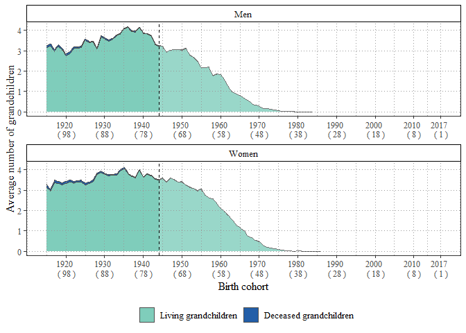<!-- -->

#### Fig. 1: Average number of living and dead grandchildren and proportional distribution of the number of living grandchildren in 2017 by sex and birth cohort

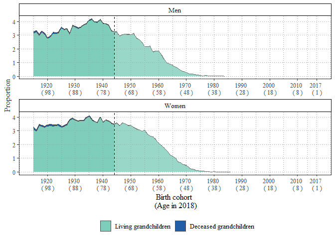<!-- -->

    ## Warning: The `size` argument of `element_line()` is deprecated as of ggplot2 3.4.0.
    ## i Please use the `linewidth` argument instead.
    ## This warning is displayed once every 8 hours.
    ## Call `lifecycle::last_lifecycle_warnings()` to see where this warning was
    ## generated.

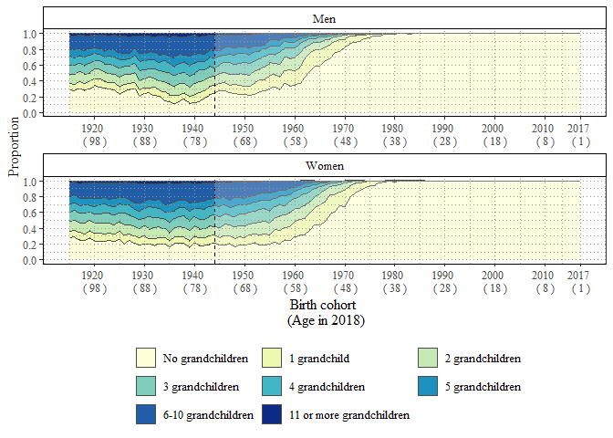<!-- -->

#### Fig. 2: Average number of living and dead children and proportional distribution of the number of living children, in 2017 by sex and birth cohort

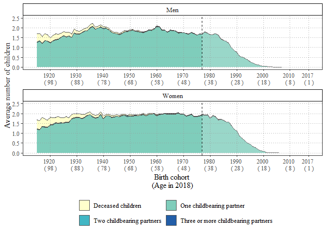<!-- -->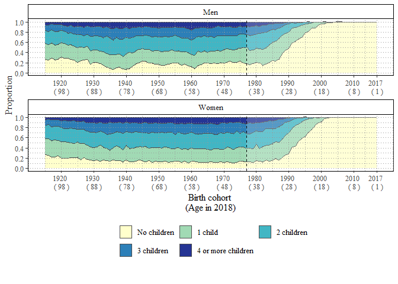<!-- -->

#### Fig. 3: Average number of nieces and nephews by birth cohort and through full or half-sister/brother

<!-- -->

#### Fig. 4: Average number of siblings by birth cohort and whether full or half-sibling and Proportional distribution of the number of siblings (half- or full) by birth cohort

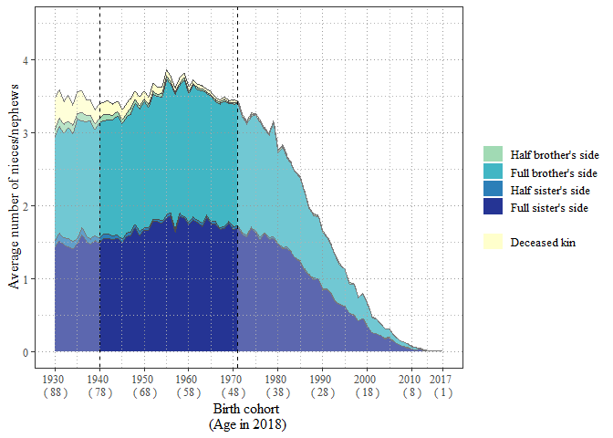<!-- -->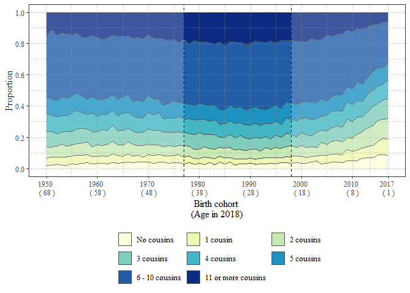<!-- -->

#### Fig. 5: Average number of cousins by birth cohort and by type of aunt or uncle and Proportional distribution of the number of cousins by birth cohort

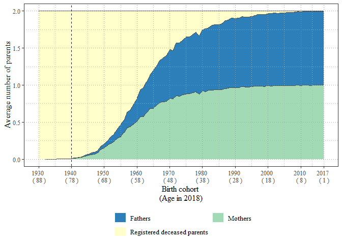<!-- -->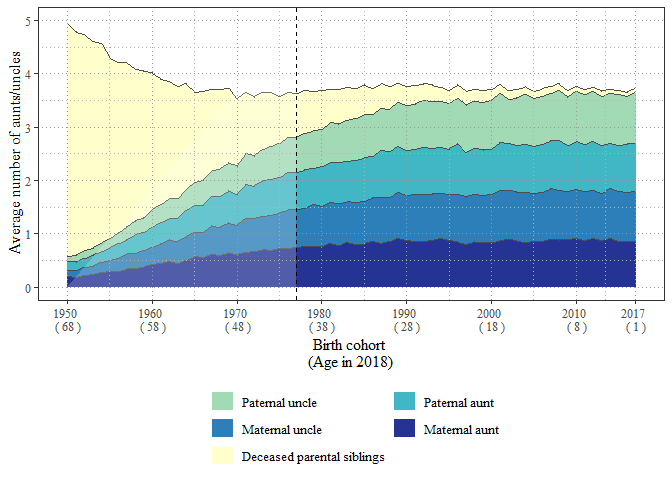<!-- -->

#### Fig. 6. Average number of living, dead, and unregistered parents, by birth cohort 1932–2017 and Average number of parent siblings by birth cohort 1950–2017

<!-- --><!-- -->

#### Fig. 7: Average number of living, dead, and unregistered grandparents, by birth cohort

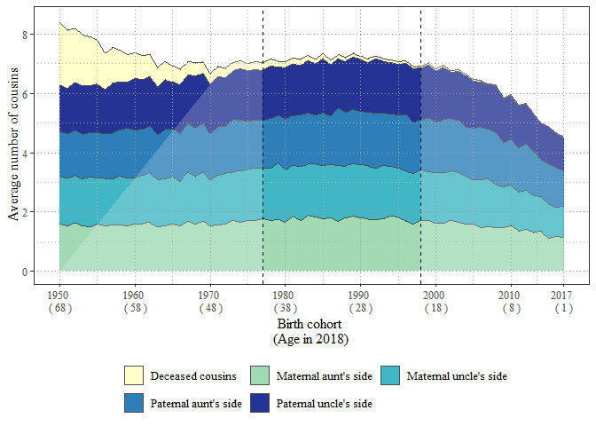<!-- -->

#### Fig. 8: Distribution of the total number of kin and average number of all types of kin by birth cohort 1915–2017

    ## Warning: The following aesthetics were dropped during statistical transformation: weight
    ## i This can happen when ggplot fails to infer the correct grouping structure in
    ##   the data.
    ## i Did you forget to specify a `group` aesthetic or to convert a numerical
    ##   variable into a factor?

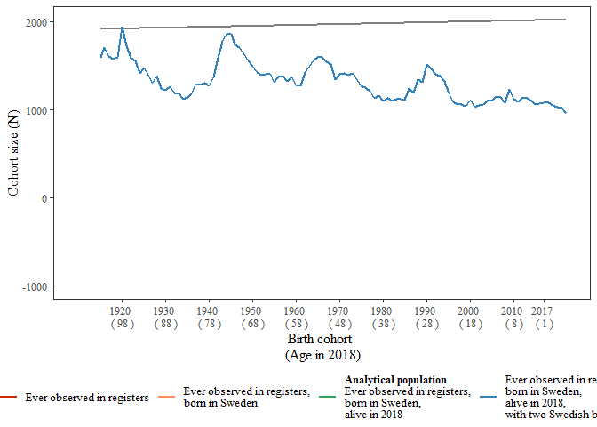<!-- -->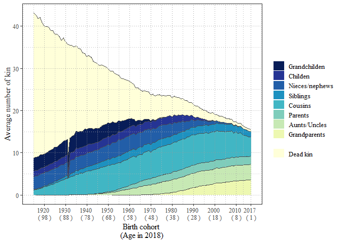<!-- -->
