Attempting to replicate the Swedish Kinship Universe plots with SOCSIM
data and Excel files
================
…
2024-02-13

``` r
library(tidyverse)
library(cowplot)
library(data.table)
library(extrafont)
library(fs)
library(ggthemes)
library(ggtext)
library(RColorBrewer)
library(readxl)
windowsFonts(Times = windowsFont("Times New Roman"))

load("Output/reference_table_SweBorn.RData")
load("Output/N_Cohort.RData")
load("Output/temp.RData")
```

``` r
# Import the data for the figures included in "The Swedish Kinship Universe" (online appendix 2)

# Set the path of the file
file_SKU <- "kolk_esm2.xlsx"

## Set the names of the sheets to keep from each file
sheets_to_keep <- set_names(c("Fig1a", "Fig1b", "Fig2a", "Fig2b", "Fig3", "Fig4a", "Fig4b",
                              "Fig5a", "Fig5b", "Fig6a", "Fig6b", "Fig7", "Fig8b"))

SKU <- map_dfr(sheets_to_keep, ~ read_excel(path=file_SKU, sheet = .x), .id = "Fig")

SKU <- SKU %>% rename(Kon = gender)  # male=1 and female=2
```

#### Fig. 1b: Average number of living and dead grandchildren in 2017 by sex and birth cohort. Swedish Kinship Universe (left) vs SOCSIM (right)

``` r
Fig1b_SKU <- ggplot() +
  geom_area(data = SKU %>% 
              filter(Fig == "Fig1b") %>% 
              mutate(isAlive = if_else(type == "registered deceased", FALSE, TRUE)), 
            mapping = aes(x = IDbirthYear, y = mean_grandchildren, fill = isAlive), color = "grey30") +
  geom_area(data=data.frame(x = c(2017-73,2017), y = c(4,4)), aes(x=x,y=y), fill = "white", alpha = 0.2) + 
  geom_vline(xintercept = c(2017-73), color = "black", lty = 2) +
  facet_wrap(~ Kon, labeller = labeller(Kon = c("1" = "Men", "2" = "Women")), ncol = 1, scales = "free_x", strip.position = "top") +
  scale_fill_manual(values = c("#225EA8", "#7FCDBB"), 
                    limits = c("FALSE", "TRUE"), 
                    labels = c("Deceased grandchildren", "Living grandchildren")) +
  labs(x = "Birth cohort", y = "Average number of grandchildren", fill = "") +
  scale_x_continuous(breaks   = c(seq(1920, 2010,by = 10), 2017), labels = paste(c(seq(1920, 2010,by = 10), 2017), "\n", "(",2018 - c(seq(1920, 2010,by = 10), 2017),")")) +
  theme_bw() +
  theme(panel.grid.major.y = element_line(colour = "grey60", linewidth = 0.3, linetype = 9),
        panel.grid.major.x = element_line(colour = "grey60", linewidth = 0.3, linetype = 9),
        panel.grid.minor.x = element_line(colour = "grey60", linewidth = 0.3, linetype = 9),
        panel.grid.minor = element_blank(),
        legend.position = "bottom",
        panel.background = element_rect(fill = NA), 
        panel.ontop = TRUE,
        text = element_text(family = "Times", size = 12),
        legend.key = element_blank(),
        strip.background = element_rect(color = "black", fill = "white")) +
  guides(fill = guide_legend(reverse = TRUE))


grandchild_table <- reference_table_SweBorn %>% 
  filter(refGroup == "grandchild" & !is.na(refID) & !is.na(refIDbirthYear) & IDbirthYear >= 1915 & IDbirthYear <= 2017) %>%
  mutate(isAlive = refIDdeathYear > 2017) %>%
  setDT() %>% 
  left_join(., temp, by = c("IDbirthYear", "Kon"))

grandchild_table <- distinct(grandchild_table[, .(mean_grandchildren = .N / N_17),keyby = .(IDbirthYear, Kon, isAlive)])

grandchildren_dist_Table <-  reference_table_SweBorn %>%
  filter(refGroup == "grandchild" & IDbirthYear >= 1915 & IDbirthYear <= 2017) %>%
  left_join(., temp, by = c("IDbirthYear", "Kon")) %>%
  mutate(isAlive = refIDdeathYear > 2017) %>%
  setDT

grandchildren_dist_Table_living <- rbind(grandchildren_dist_Table[is.na(refID),.(n_grandchildren = 0),keyby = .(ID, IDbirthYear, Kon, N_17)][,.(freq = .N),keyby = .(IDbirthYear, Kon, N_17, n_grandchildren)],
                                         grandchildren_dist_Table[isAlive == TRUE & !is.na(refID),.(n_grandchildren = .N),keyby = .(ID, IDbirthYear, Kon, N_17)][,.(freq = .N),keyby = .(IDbirthYear, Kon, N_17, n_grandchildren)]) %>%
  mutate(n_grandchildren = ifelse(n_grandchildren > 5 & n_grandchildren < 11, "6-10",ifelse(n_grandchildren > 10,">10",as.character(n_grandchildren))),
         n_grandchildren = factor(n_grandchildren, levels = c(">10","6-10","5","4","3","2","1","0")),
         n_grandchildren = fct_recode(n_grandchildren,
                                      "No grandchildren" = "0",
                                      "1 grandchild" = "1",
                                      "2 grandchildren" = "2",
                                      "3 grandchildren" = "3",
                                      "4 grandchildren" = "4",
                                      "5 grandchildren" = "5",
                                      "6-10 grandchildren" = "6-10",
                                      "11 or more grandchildren" = ">10")) %>%
  .[,.(freq =sum(freq)) ,keyby = .(IDbirthYear, Kon,  N_17, n_grandchildren)]%>%
  .[,.(n_grandchildren = n_grandchildren, freq = freq, N_17 = sum(freq), proportion = freq /sum(freq)),keyby = .(IDbirthYear, Kon)]

grandchildren_dist_Table <- rbind(grandchildren_dist_Table[is.na(refID),.(n_grandchildren = 0),keyby = .(ID, IDbirthYear, Kon, N_17)][,.(freq = .N),keyby = .(IDbirthYear, Kon, N_17, n_grandchildren)],
                                  grandchildren_dist_Table[!is.na(refID),.(n_grandchildren = .N),keyby = .(ID, IDbirthYear, Kon, N_17)][,.(freq = .N),keyby = .(IDbirthYear, Kon, N_17, n_grandchildren)]) %>%
  mutate(n_grandchildren = ifelse(n_grandchildren > 5 & n_grandchildren < 11, "6-10",ifelse(n_grandchildren > 10,">10",as.character(n_grandchildren))),
         n_grandchildren = factor(n_grandchildren, levels = c(">10","6-10","5","4","3","2","1","0")),
         n_grandchildren = fct_recode(n_grandchildren,
                                      "No grandchildren" = "0",
                                      "1 grandchild" = "1",
                                      "2 grandchildren" = "2",
                                      "3 grandchildren" = "3",
                                      "4 grandchildren" = "4",
                                      "5 grandchildren" = "5",
                                      "6-10 grandchildren" = "6-10",
                                      "11 or more grandchildren" = ">10")) %>%
  .[,.(freq =sum(freq)) ,keyby = .(IDbirthYear, Kon,  N_17, n_grandchildren)]%>%
  .[,.(n_grandchildren = n_grandchildren, freq = freq, N_17 = sum(freq), proportion = freq /sum(freq)),keyby = .(IDbirthYear, Kon)]


Fig1b_socsim <- ggplot() +
  geom_area(data = grandchild_table, mapping = aes(x = IDbirthYear, y = mean_grandchildren, fill = isAlive), color = "grey30") +
  geom_area(data=data.frame(x = c(2017-73,2017), y = c(4,4)), aes(x=x,y=y), fill = "white", alpha = 0.2) + 
  geom_vline(xintercept = c(2017-73), color = "black", lty = 2) +
  facet_wrap(~ Kon, labeller = labeller(Kon = c("1" = "Men", "2" = "Women")), ncol = 1, scales = "free_x", strip.position = "top") +
  scale_fill_manual(values = c("#225EA8", "#7FCDBB"), 
                    limits = c("FALSE", "TRUE"), 
                    labels = c("Deceased grandchildren", "Living grandchildren")) +
  labs(x = "Birth cohort", y = "Average number of grandchildren", fill = "") +
  scale_x_continuous(breaks   = c(seq(1920, 2010,by = 10), 2017), labels = paste(c(seq(1920, 2010,by = 10), 2017), "\n", "(",2018 - c(seq(1920, 2010,by = 10), 2017),")")) +
  theme_bw() +
  theme(panel.grid.major.y = element_line(colour = "grey60", linewidth = 0.3, linetype = 9),
        panel.grid.major.x = element_line(colour = "grey60", linewidth = 0.3, linetype = 9),
        panel.grid.minor.x = element_line(colour = "grey60", linewidth = 0.3, linetype = 9),
        panel.grid.minor = element_blank(),
        legend.position = "bottom",
        panel.background = element_rect(fill = NA), 
        panel.ontop = TRUE,
        text = element_text(family = "Times", size = 12),
        legend.key = element_blank(),
        strip.background = element_rect(color = "black", fill = "white")) +
  guides(fill = guide_legend(reverse = TRUE))

plot_grid(Fig1b_SKU, Fig1b_socsim, align = "hv")
```


#### Fig. 1a: Proportional distribution of the number of living grandchildren in 2017 by sex and birth cohort. Swedish Kinship Universe (left) vs SOCSIM (right)

``` r
Fig1a_SKU <- ggplot(data = SKU %>% 
                      filter(Fig == "Fig1a") %>% 
                      mutate(n_grandchildren = factor(n_grandchildren, 
                                    levels = c("11 or more grandchildren",                                                "6-10 grandchildren",
                                               "5 grandchildren",
                                               "4 grandchildren",
                                               "3 grandchildren",
                                               "2 grandchildren",
                                               "1 grandchild",
                                               "No grandchildren")))) +
  geom_area(mapping = aes(x = IDbirthYear, y = proportion, fill = n_grandchildren), color = "grey30", lwd = 0.7) +
  geom_area(data=data.frame(x = c(2017-73,2017), y = c(1,1)), aes(x=x,y=y), fill = "white", alpha = 0.2) +
  geom_vline(xintercept = c(2017-73), color = "black", lty = 2) +
  facet_wrap(~ Kon, labeller = labeller(Kon = c("1" = "Men", "2" = "Women")), ncol = 1, scales = "free_x", strip.position = "top") +
  labs(x = "Birth cohort \n (Age in 2017)", y = "Proportion", fill = "")+
  scale_fill_brewer(palette = "YlGnBu", direction = -1 ) +
  scale_x_continuous(breaks   = c(seq(1920, 2010,by = 10), 2017), labels = paste(c(seq(1920, 2010,by = 10), 2017), "\n", "(",2018 - c(seq(1920, 2010,by = 10), 2017),")")) +
  scale_y_continuous(breaks = seq(0,1, by = 0.2))+
  theme_bw() +
  guides(fill = guide_legend(reverse = TRUE, ncol = 3, byrow = TRUE)) +
  theme(panel.grid.major.y = element_line(colour = "grey60", size = 0.3, linetype = 9),
        panel.grid.major.x = element_line(colour = "grey60", size = 0.3, linetype = 9),
        panel.grid.minor.y = element_line(colour = "grey60", size = 0.3, linetype = 9),
        panel.grid.minor.x = element_line(colour = "grey60", size = 0.3, linetype = 9),
        axis.line = element_line(),
        legend.position = "bottom",
        panel.background = element_rect(fill = NA),
        panel.ontop = TRUE,
        text = element_text(family = "Times", size = 12),
        legend.key = element_blank(),
        strip.background = element_rect(color = "black", fill = "white"))


Fig1a_socsim <- ggplot(data = filter(grandchildren_dist_Table_living, IDbirthYear <= 2017)) +
  geom_area(mapping = aes(x = IDbirthYear, y = proportion, fill = n_grandchildren), color = "grey30", lwd = 0.7) +
  geom_area(data=data.frame(x = c(2017-73,2017), y = c(1,1)), aes(x=x,y=y), fill = "white", alpha = 0.2) + 
  geom_vline(xintercept = c(2017-73), color = "black", lty = 2) +
  facet_wrap(~ Kon, labeller = labeller(Kon = c("1" = "Men", "2" = "Women")), ncol = 1, scales = "free_x", strip.position = "top") +
  labs(x = "Birth cohort \n (Age in 2017)", y = "Proportion", fill = "")+
  scale_fill_brewer(palette = "YlGnBu", direction = -1 ) + 
  scale_x_continuous(breaks   = c(seq(1920, 2010,by = 10), 2017), labels = paste(c(seq(1920, 2010,by = 10), 2017), "\n", "(",2018 - c(seq(1920, 2010,by = 10), 2017),")")) +
  scale_y_continuous(breaks = seq(0,1, by = 0.2))+
  theme_bw() + 
  guides(fill = guide_legend(reverse = TRUE, ncol = 3, byrow = TRUE)) + 
  theme(panel.grid.major.y = element_line(colour = "grey60", size = 0.3, linetype = 9),
        panel.grid.major.x = element_line(colour = "grey60", size = 0.3, linetype = 9),
        panel.grid.minor.y = element_line(colour = "grey60", size = 0.3, linetype = 9),
        panel.grid.minor.x = element_line(colour = "grey60", size = 0.3, linetype = 9),
        axis.line = element_line(),
        legend.position = "bottom",
        panel.background = element_rect(fill = NA), 
        panel.ontop = TRUE,
        text = element_text(family = "Times", size = 12),
        legend.key = element_blank(),
        strip.background = element_rect(color = "black", fill = "white"))

plot_grid(Fig1a_SKU, Fig1a_socsim, align = "hv")
```

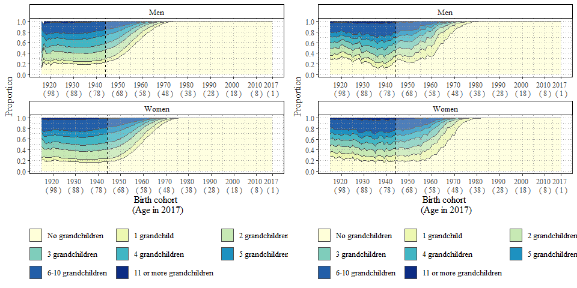

#### Fig. 2b: Average number of living and dead children in 2017 by sex and birth cohort. Swedish Kinship Universe (left) vs SOCSIM (right)

``` r
Fig2b_SKU <- ggplot() +
  geom_area(data = SKU %>% 
              mutate(type = factor(type, levels = c("registered deceased", ">2", "2", "1"))) %>% 
              filter(Fig == "Fig2b" & type == "registered deceased"), 
            mapping = aes(x = IDbirthYear, y = mean_children, fill = type), color = "grey30", lwd = 0.5) +
  geom_area(data = SKU %>% 
              mutate(type = factor(type, levels = c("registered deceased", ">2", "2", "1"))) %>% 
              filter(Fig == "Fig2b" & type != "registered deceased"), 
            mapping = aes(x = IDbirthYear, y = mean_children, fill = type), color = "grey30", lwd = 0.5) +
  geom_area(data=data.frame(x = c(2017-40,2017), y = c(2.5,2.5)), aes(x=x,y=y), fill = "white", alpha = 0.2) +
  geom_vline(xintercept = c(2017-40), color = "black", lty = 2) +
  facet_wrap(~ Kon, labeller = labeller(Kon = c("1" = "Men", "2" = "Women")), ncol = 1,scales = "free_x") +
  scale_fill_manual(values = c("#7FCDBB","#41B6C4", "#225EA8", "#FFFFCC"), 
                    limits = c("1", "2", ">2", "registered deceased"), 
                    labels = c("One childbearing partner","Two childbearing partners", "Three or more childbearing partners", "Deceased children")) +
  labs(x = "Birth cohort \n(Age in 2017)", y = "Average number of children", fill = " ") +
  theme_bw() +
  guides(fill = guide_legend(reverse = TRUE, ncol = 2, byrow = TRUE)) + 
  scale_x_continuous(breaks   = c(seq(1920, 2010,by = 10), 2017), labels = paste(c(seq(1920, 2010,by = 10), 2017), "\n", "(",2018 - c(seq(1920, 2010,by = 10), 2017),")")) +
  theme(panel.grid.major.y = element_line(colour = "grey60", size = 0.3, linetype = 9),
        panel.grid.major.x = element_line(colour = "grey60", size = 0.3, linetype = 9),
        panel.grid.minor = element_blank(),
        legend.position = "bottom",
        panel.background = element_rect(fill = NA), 
        panel.ontop = TRUE,
        text = element_text(family = "Times", size = 12),
        legend.key = element_blank(),
        strip.placement = "outside",
        strip.background = element_rect(color = "black", fill = "white"))


children_dist_Table <-  
  reference_table_SweBorn %>%
  filter(refGroup == "child" & IDbirthYear >= 1915 & IDbirthYear <= 2018) %>%
  left_join(., temp, by = c("IDbirthYear", "Kon")) %>%
  mutate(isAlive = refIDdeathYear >= 2017) %>% 
  setDT

children_dist_Table_living <- 
  rbind(
    children_dist_Table[is.na(refID),.(n_children = 0),keyby = .(ID, IDbirthYear, Kon, N_17)][,.(freq = .N),keyby = .(IDbirthYear, Kon, N_17, n_children)]
    , children_dist_Table[isAlive == TRUE & !is.na(refID),.(n_children = .N),keyby = .(ID, IDbirthYear, Kon, N_17)][,.(freq = .N),keyby = .(IDbirthYear, Kon, N_17, n_children)]
    ) %>%
  mutate(n_children = ifelse(n_children > 3, ">3", as.character(n_children)),
         n_children = factor(n_children, levels = c(">3","3","2","1","0")),
         n_children = fct_recode(n_children,
                                 "4 or more children" = ">3",
                                 "3 children" = "3",
                                 "2 children" = "2",
                                 "1 child" = "1",
                                 "No children" = "0")) %>%
  .[,.(freq =sum(freq)) ,keyby = .(IDbirthYear, Kon,  N_17, n_children)] %>%
  .[,.(n_children = n_children, freq = freq, N_17 = sum(freq), proportion = freq /sum(freq)),keyby = .(IDbirthYear, Kon)]


child_table <- reference_table_SweBorn %>% 
  filter(refGroup == "child" & !is.na(refID) & IDbirthYear >= 1915 & IDbirthYear <= 2017) %>%
  mutate(isAlive = refIDdeathYear > 2017) %>%
  group_by(ID) %>%
  mutate(n_partners = max(refTypeIII),
         n_partners = ifelse(n_partners >2, ">2", as.character(n_partners)),
         n_partners = factor(n_partners, levels = c("1","2",">2"))) %>%
  ungroup() %>%
  setDT() %>% 
  left_join(., temp, by = c("IDbirthYear", "Kon"))

child_table <- rbind(child_table[, .(mean_children = .N / N_17, Type = "not living"),keyby = .(IDbirthYear, Kon)],
                     child_table[isAlive == TRUE, .(mean_children = .N / N_17),keyby = .(IDbirthYear, Type = n_partners, Kon)]) %>%
  distinct()

child_table <- child_table %>% 
  mutate(Type = factor(Type, levels = c("not living", ">2", "2", "1")))

Fig2b_socsim <- ggplot() +
  geom_area(data = child_table %>% filter(Type == "not living"),
            mapping = aes(x = IDbirthYear, y = mean_children, fill = Type), color = "grey30", lwd = 0.5) +
  geom_area(data = child_table %>% filter(Type != "not living"), 
            mapping = aes(x = IDbirthYear, y = mean_children, fill = Type), color = "grey30", lwd = 0.5) +
  geom_area(data=data.frame(x = c(2017-40,2017), y = c(2.5,2.5)), aes(x=x,y=y), fill = "white", alpha = 0.2) + 
  geom_vline(xintercept = c(2017-40), color = "black", lty = 2) +
  facet_wrap(~ Kon, labeller = labeller(Kon = c("1" = "Men", "2" = "Women")), ncol = 1,scales = "free_x") +
  scale_fill_manual(values = c("#7FCDBB","#41B6C4", "#225EA8","#FFFFCC"), 
                    limits = c("1", "2", ">2","not living"), 
                    labels = c("One childbearing partner","Two childbearing partners","Three or more childbearing partners","Deceased children")) +
  labs(x = "Birth cohort \n(Age in 2017)", y = "Average number of children", fill = " ") +
  theme_bw() +
  guides(fill = guide_legend(reverse = TRUE, ncol = 2, byrow = TRUE)) + 
  scale_x_continuous(breaks   = c(seq(1920, 2010,by = 10), 2017), labels = paste(c(seq(1920, 2010,by = 10), 2017), "\n", "(",2018 - c(seq(1920, 2010,by = 10), 2017),")")) +
  theme(panel.grid.major.y = element_line(colour = "grey60", size = 0.3, linetype = 9),
        panel.grid.major.x = element_line(colour = "grey60", size = 0.3, linetype = 9),
        panel.grid.minor = element_blank(),
        legend.position = "bottom",
        panel.background = element_rect(fill = NA), 
        panel.ontop = TRUE,
        text = element_text(family = "Times", size = 12),
        legend.key = element_blank(),
        strip.placement = "outside",
        strip.background = element_rect(color = "black", fill = "white"))

plot_grid(Fig2b_SKU, Fig2b_socsim, align = "hv")
```

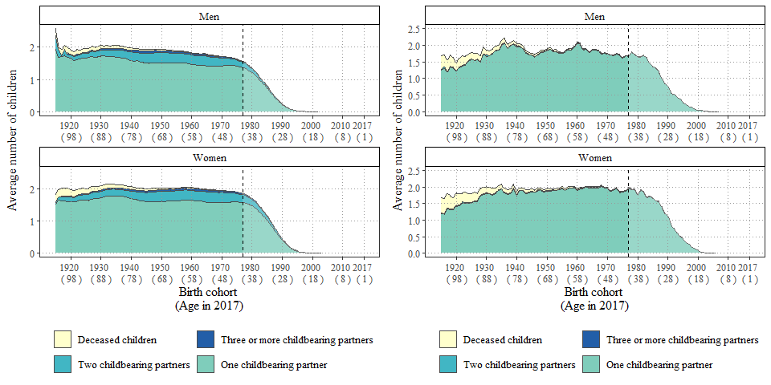

#### Fig. 2a: Proportional distribution of the number of living children in 2017 by sex and birth cohort. Swedish Kinship Universe (left) vs SOCSIM (right)

``` r
Fig2a_SKU <- ggplot(data = SKU %>% 
                      filter(Fig == "Fig2a") %>%  
                      mutate(n_children = factor(n_children, 
                                                 levels = c("4 or more children", "3 children", 
                                                            "2 children", "1 child", "No children" )))) +
  geom_area(mapping = aes(x = IDbirthYear, y = proportion, fill = n_children), color = "grey30", lwd = 0.7) +
  geom_area(data=data.frame(x = c(2017-40,2017), y = c(1,1)), aes(x=x,y=y), fill = "white", alpha = 0.2) + 
  geom_vline(xintercept = c(2017-40), color = "black", lty = 2) +
  facet_wrap(~ Kon, labeller = labeller(Kon = c("1" = "Men", "2" = "Women")), ncol = 1, scales = "free_x") +
  labs(x = "Birth cohort \n(Age in 2017)", y = "Proportion", fill = "")+
  scale_fill_manual(values = c("#253494", "#2C7FB8", "#41B6C4", "#A1DAB4", "#FFFFCC"),
                    limits = c("4 or more children", "3 children", "2 children", "1 child", "No children"), 
                    labels = c("4 or more children", "3 children", "2 children", "1 child", "No children")) +  
  scale_x_continuous(breaks   = c(seq(1920, 2010,by = 10), 2017), labels = paste(c(seq(1920, 2010,by = 10), 2017), "\n", "(",2018 - c(seq(1920, 2010,by = 10), 2017),")")) +
  scale_y_continuous(breaks = seq(0,1, by = 0.2))+
  theme_bw() +
  guides(fill = guide_legend(reverse = TRUE, ncol = 3, nrow = 3, byrow = TRUE)) +
  theme(panel.grid.major.y = element_line(colour = "grey60", size = 0.3, linetype = 9),
        panel.grid.major.x = element_line(colour = "grey60", size = 0.3, linetype = 9),
        panel.grid.minor.y = element_line(colour = "grey60", size = 0.3, linetype = 9),
        panel.grid.minor.x = element_line(colour = "grey60", size = 0.3, linetype = 9),
        axis.line = element_line(),
        legend.position = "bottom",
        panel.background = element_rect(fill = NA), 
        panel.ontop = TRUE,
        text = element_text(family = "Times", size = 12),
        legend.key = element_blank(),
        strip.placement = "outside",
        strip.background = element_rect(color = "black", fill = "white"))


Fig2a_socsim <- ggplot(data = filter(children_dist_Table_living, IDbirthYear <= 2017)) +
  geom_area(mapping = aes(x = IDbirthYear, y = proportion, fill = n_children), color = "grey30", lwd = 0.7) +
  geom_area(data=data.frame(x = c(2017-40,2017), y = c(1,1)), aes(x=x,y=y), fill = "white", alpha = 0.2) + 
  geom_vline(xintercept = c(2017-40), color = "black", lty = 2) +
  facet_wrap(~ Kon, labeller = labeller(Kon = c("1" = "Men", "2" = "Women")), ncol = 1, scales = "free_x") +
  labs(x = "Birth cohort \n(Age in 2017)", y = "Proportion", fill = "")+
  scale_fill_manual(values = c("#253494", "#2C7FB8", "#41B6C4", "#A1DAB4", "#FFFFCC"),
                    limits = c("4 or more children", "3 children", "2 children", "1 child", "No children"), 
                    labels = c("4 or more children", "3 children", "2 children", "1 child", "No children")) +  
  scale_x_continuous(breaks   = c(seq(1920, 2010,by = 10), 2017), labels = paste(c(seq(1920, 2010,by = 10), 2017), "\n", "(",2018 - c(seq(1920, 2010,by = 10), 2017),")")) +
  scale_y_continuous(breaks = seq(0,1, by = 0.2))+
  theme_bw() +
  guides(fill = guide_legend(reverse = TRUE, ncol = 3, nrow = 3, byrow = TRUE)) +
  theme(panel.grid.major.y = element_line(colour = "grey60", size = 0.3, linetype = 9),
        panel.grid.major.x = element_line(colour = "grey60", size = 0.3, linetype = 9),
        panel.grid.minor.y = element_line(colour = "grey60", size = 0.3, linetype = 9),
        panel.grid.minor.x = element_line(colour = "grey60", size = 0.3, linetype = 9),
        axis.line = element_line(),
        legend.position = "bottom",
        panel.background = element_rect(fill = NA), 
        panel.ontop = TRUE,
        text = element_text(family = "Times", size = 12),
        legend.key = element_blank(),
        strip.placement = "outside",
        strip.background = element_rect(color = "black", fill = "white"))

plot_grid(Fig2a_SKU, Fig2a_socsim, align = "hv")
```

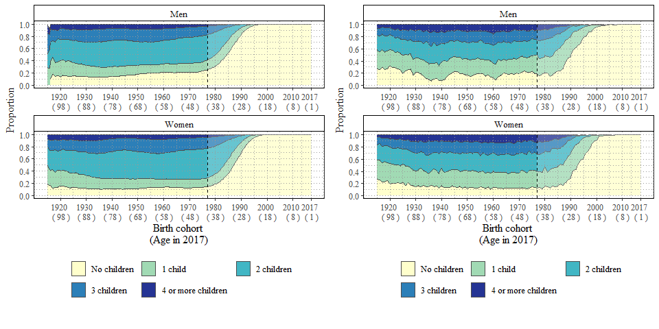

#### Fig. 3: Average number of nieces and nephews by birth cohort and through full or half-sister/brother. Swedish Kinship Universe (left) vs SOCSIM (right)

``` r
Fig3_SKU <- ggplot() +
    geom_area(data = SKU %>%
              mutate(type = factor(type,
                                   levels = c("registered deceased",
                                              "half brother side", "full brother side",
                                              "half sister side", "full sister side"))) %>% 
              filter(Fig == "Fig3" & type == "registered deceased"), 
            mapping = aes(x = IDbirthYear, y = mean_kin, fill = type), 
            color = "grey30", lwd = 0.5) +
    geom_area(data = SKU %>%
              mutate(type = factor(type,
                                   levels = c("registered deceased",
                                              "half brother side", "full brother side",
                                              "half sister side", "full sister side"))) %>% 
              filter(Fig == "Fig3" & type != "registered deceased"), 
            mapping = aes(x = IDbirthYear, y = mean_kin, fill = type), 
            color = "grey30", lwd = 0.5) +
  geom_area(data=data.frame(x = c(1930,1940), y = c(4.5,4.5)), aes(x=x,y=y), fill = "white", alpha = 0.25) + 
  geom_area(data=data.frame(x = c(2017-46,2017), y = c(4.5,4.5)), aes(x=x,y=y), fill = "white", alpha = 0.25) + 
  geom_vline(xintercept = c(1940, 2017-46), color = "black", lty = 2) +
  labs(x = "Birth cohort \n(Age in 2017)", y = "Average number of nieces/nephews", fill = "") +
  scale_fill_manual(values = c( "#FFFFCC","#A1DAB4", "#41B6C4", "#2C7FB8", "#253494"),
                    limits = c("registered deceased",
                               "half brother side", "full brother side",
                               "half sister side", "full sister side"),
                    labels = c("Deceased nieces \n and nephews", "Half brother's side", "Full brother's side", 
                               "Half sister's side","Full sister's side")) +
  scale_x_continuous(breaks   = c(seq(1920, 2010,by = 10), 2017), labels = paste(c(seq(1920, 2010,by = 10), 2017), "\n", "(",2018 - c(seq(1920, 2010,by = 10), 2017),")")) +
  theme_bw() +
  theme(panel.grid.major.y = element_line(colour = "grey60", size = 0.3, linetype = 9),
        panel.grid.major.x = element_line(colour = "grey60", size = 0.3, linetype = 9),
        panel.grid.minor = element_line(colour = "grey70", size = 0.3, linetype = 9),
        legend.position = "right",
        legend.key.height = unit(1, "line"),
        panel.background = element_rect(fill = NA), 
        panel.ontop = TRUE,
        text = element_text(family = "Times", size = 12)) +
  guides(fill = guide_legend(override.aes = list(color = 0)))


sibchild_table <- reference_table_SweBorn %>% 
  filter(refGroup == "sibchild" & !is.na(refID) & IDbirthYear >= 1930 & IDbirthYear <= 2017) %>%
  mutate(isAlive = refIDdeathYear > 2017,
         Type = paste(refTypeIIII, refTypeIII, "side", sep = " "),
         Type = factor(Type, levels = c("half brother side","full brother side","half sister side","full sister side"))) %>%
  setDT() %>% 
  left_join(., select(N_Cohort, IDbirthYear, N_17), by = c("IDbirthYear"))


sibchild_table  <- rbind(sibchild_table[, .(mean_kin = .N / N_17, Type = "not living"),keyby = .(IDbirthYear)],
                         sibchild_table[isAlive == TRUE, .(mean_kin = .N / N_17),keyby = .(IDbirthYear, Type)]) %>%
  distinct()

Fig3_socsim <- ggplot() +
  geom_area(data = sibchild_table %>% 
              filter(Type == "not living" & IDbirthYear <= 2017),
            mapping = aes(x = IDbirthYear, y = mean_kin, fill = Type), color = "grey30", lwd = 0.5) +
  geom_area(data = sibchild_table %>% 
              filter(Type != "not living" & IDbirthYear <= 2017),
            mapping = aes(x = IDbirthYear, y = mean_kin, fill = Type), color = "grey30", lwd = 0.5) +
  geom_area(data=data.frame(x = c(1930,1940), y = c(4.5,4.5)), aes(x=x,y=y), fill = "white", alpha = 0.25) + 
  geom_area(data=data.frame(x = c(2017-46,2017), y = c(4.5,4.5)), aes(x=x,y=y), fill = "white", alpha = 0.25) + 
  geom_vline(xintercept = c(1940, 2017-46), color = "black", lty = 2) +
  labs(x = "Birth cohort \n(Age in 2017)", y = "Average number of nieces/nephews", fill = "") +
  scale_fill_manual(values = c("#FFFFCC", "#A1DAB4", "#41B6C4", "#2C7FB8", "#253494"),
                    limits = c(levels=c("not living", 
                                        "half brother side", "full brother side",
                                        "half sister side", "full sister side")),
                    labels = c("Deceased nieces \n and nephews", 
                               "Half brother's side","Full brother's side",
                               "Half sister's side","Full sister's side")) +
  scale_x_continuous(breaks   = c(seq(1920, 2010,by = 10), 2017), labels = paste(c(seq(1920, 2010,by = 10), 2017), "\n", "(",2018 - c(seq(1920, 2010,by = 10), 2017),")")) +
  theme_bw() +
  theme(panel.grid.major.y = element_line(colour = "grey60", size = 0.3, linetype = 9),
        panel.grid.major.x = element_line(colour = "grey60", size = 0.3, linetype = 9),
        panel.grid.minor = element_line(colour = "grey70", size = 0.3, linetype = 9),
        legend.position = "right",
        legend.key.height = unit(1, "line"),
        panel.background = element_rect(fill = NA), 
        panel.ontop = TRUE,
        text = element_text(family = "Times", size = 12)) +
  guides(fill = guide_legend(override.aes = list(color = 0)))

plot_grid(Fig3_SKU, Fig3_socsim, align = "hv")
```

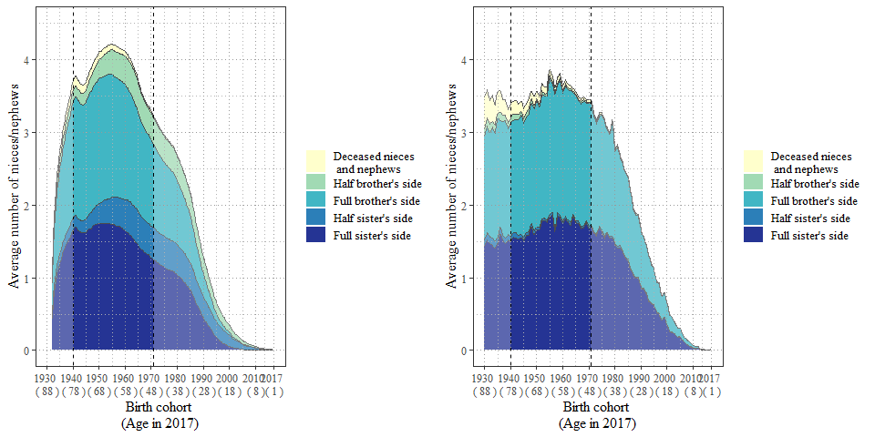

#### Fig. 4a: Average number of siblings by birth cohort and whether full or half-sibling by birth cohort. Swedish Kinship Universe (left) vs SOCSIM (right)

``` r
Fig4a_SKU <- ggplot() +
  geom_area(data = SKU %>%
              filter(Fig == "Fig4a") %>%
              mutate(type = factor(type,
                                   levels = c("not living",
                                              "full", 
                                              "half.father", 
                                              "half.mother"))) %>% 
              filter(Fig == "Fig4a" & type == "not living"), 
              mapping = aes(x = IDbirthYear, y = mean_siblings, fill = type), 
              color = "grey30", lwd = 0.5) +
  geom_area(data = SKU %>%
              filter(Fig == "Fig4a") %>%
              mutate(type = factor(type,
                                   levels = c("not living",
                                              "full",
                                              "half.father",
                                              "half.mother"))) %>% 
            filter(Fig == "Fig4a" & type != "not living"), 
            mapping = aes(x = IDbirthYear, y = mean_siblings, fill = type), 
            color = "grey30", lwd = 0.5) +
  geom_area(data=data.frame(x = c(1930,1940), y = c(2.5,2.5)), aes(x=x,y=y), fill = "white", alpha = 0.25) + 
  geom_area(data=data.frame(x = c(2017-13,2017), y = c(2.5,2.5)), aes(x=x,y=y), fill = "white", alpha = 0.25) + 
  geom_vline(xintercept = c(1940, 2017-13), color = "black", lty = 2) +
  scale_fill_manual(values = c("#A1DAB4", "#41B6C4", "#225EA8","#FFFFCC"), 
                    limits = c("half.mother", "half.father", "full", "not living"), 
                    labels = c("Half siblings on mother's side", "Half siblings on father's side", 
                               "Full siblings", "Deceased siblings")) +
  labs(x = "Birth cohort \n(Age in 2017)", y = "Average number of siblings", fill = "") +
  scale_x_continuous(breaks   = c(seq(1920, 2010,by = 10), 2017), labels = paste(c(seq(1920, 2010,by = 10), 2017), "\n", "(",2018 - c(seq(1920, 2010,by = 10), 2017),")")) +
  theme_bw() +
  theme(panel.grid.major.y = element_line(colour = "grey60", size = 0.3, linetype = 9),
        panel.grid.major.x = element_line(colour = "grey60", size = 0.3, linetype = 9),
        panel.grid.minor = element_line(colour = "grey70", size = 0.3, linetype = 9),
        legend.position = "bottom",
        panel.background = element_rect(fill = NA), 
        panel.ontop = TRUE,
        text = element_text(family = "Times", size = 12)) +
  guides(fill = guide_legend(ncol = 2, byrow = TRUE, reverse = TRUE))

sibling_table <- reference_table_SweBorn %>% 
  filter(refGroup == "sibling" & !is.na(refID) & IDbirthYear >= 1930 & IDbirthYear <= 2017) %>%
  mutate(isAlive = refIDdeathYear > 2017) %>%
  setDT() %>% 
  left_join(., select(N_Cohort, IDbirthYear, N_17), by = c("IDbirthYear"))

sibling_table <- rbind(sibling_table[, .(mean_siblings = .N / N_17, refTypeIIII = "not living"),keyby = .(IDbirthYear)],
                       sibling_table[isAlive == TRUE, .(mean_siblings = .N / N_17),keyby = .(IDbirthYear, refTypeIIII)]) %>%
  distinct()

sibling_dist_Table <-  reference_table_SweBorn %>%
  filter(refGroup == "sibling" & IDbirthYear >= 1930 & IDbirthYear <= 2017) %>%
  left_join(., select(N_Cohort, IDbirthYear, N_17), by = c("IDbirthYear")) %>%
  mutate(isAlive = refIDdeathYear >= 2017) %>% 
  setDT

sibling_dist_Table_living <- rbind(sibling_dist_Table[is.na(refID),.(n_siblings = 0),keyby = .(ID, IDbirthYear, N_17)][,.(freq = .N),keyby = .(IDbirthYear, N_17, n_siblings)],
                                   sibling_dist_Table[isAlive == TRUE & !is.na(refID),.(n_siblings = .N),keyby = .(ID, IDbirthYear, N_17)][,.(freq = .N),keyby = .(IDbirthYear, N_17, n_siblings)]) %>%
  mutate(n_siblings = ifelse(n_siblings > 5, ">5", as.character(n_siblings)),
         n_siblings = factor(n_siblings, levels = c(">5","5","4","3","2","1","0")),
         n_siblings = fct_recode(n_siblings,
                                 "No siblings" = "0",
                                 "1 sibling" = "1",
                                 "2 siblings" = "2",
                                 "3 siblings" = "3",
                                 "4 siblings" = "4",
                                 "5 siblings" = "5",
                                 "6 or more siblings" = ">5")) %>%
  .[,.(freq =sum(freq)) ,keyby = .(IDbirthYear,  N_17, n_siblings)]%>%
  .[,.(n_siblings = n_siblings, freq = freq, N_17 = sum(freq), proportion = freq /sum(freq)),keyby = .(IDbirthYear)]

Fig4a_socsim <- ggplot() +
  geom_area(data = sibling_table[refTypeIIII == "not living"], mapping = aes(x = IDbirthYear, y = mean_siblings, fill = refTypeIIII), color = "grey30", lwd = 0.5) +
  geom_area(data = sibling_table[refTypeIIII != "not living"], mapping = aes(x = IDbirthYear, y = mean_siblings, fill = refTypeIIII), color = "grey30", lwd = 0.5) +
  geom_area(data=data.frame(x = c(1930,1940), y = c(2.5,2.5)), aes(x=x,y=y), fill = "white", alpha = 0.25) + 
  geom_area(data=data.frame(x = c(2017-13,2017), y = c(2.5,2.5)), aes(x=x,y=y), fill = "white", alpha = 0.25) + 
  geom_vline(xintercept = c(1940, 2017-13), color = "black", lty = 2) +
  scale_fill_manual(values = c("#A1DAB4", "#41B6C4", "#225EA8","#FFFFCC"), 
                    limits = c("half.mother", "half.father", "full", "not living"), 
                    labels = c("Half siblings on mother's side", "Half siblings on father's side", 
                               "Full siblings", "Deceased siblings")) +
  labs(x = "Birth cohort \n(Age in 2017)", y = "Average number of siblings", fill = "") +
  scale_x_continuous(breaks   = c(seq(1920, 2010,by = 10), 2017), labels = paste(c(seq(1920, 2010,by = 10), 2017), "\n", "(",2018 - c(seq(1920, 2010,by = 10), 2017),")")) +
  theme_bw() +
  theme(panel.grid.major.y = element_line(colour = "grey60", size = 0.3, linetype = 9),
        panel.grid.major.x = element_line(colour = "grey60", size = 0.3, linetype = 9),
        panel.grid.minor = element_line(colour = "grey70", size = 0.3, linetype = 9),
        legend.position = "bottom",
        panel.background = element_rect(fill = NA), 
        panel.ontop = TRUE,
        text = element_text(family = "Times", size = 12)) +
  guides(fill = guide_legend(ncol = 2, byrow = TRUE, reverse = TRUE))

plot_grid(Fig4a_SKU, Fig4a_socsim, align = "hv")
```

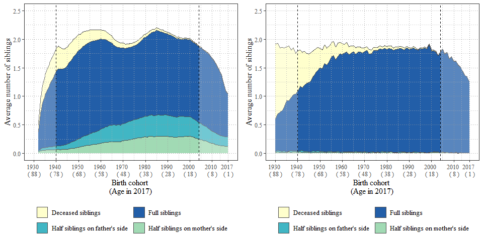

#### Fig. 4b: Proportional distribution of the number of siblings (half- or full) by birth cohort. Swedish Kinship Universe (left) vs SOCSIM (right)

``` r
Fig4b_SKU <- ggplot(data = SKU %>% 
                      filter(Fig == "Fig4b") %>%  
                      mutate(n_siblings = factor(n_siblings, 
                                                 levels = c("6 or more siblings", "5 siblings", "4 siblings",
                                                            "3 siblings", "2 siblings", "1 sibling", "No siblings")))) +
  geom_area(mapping = aes(x = IDbirthYear, y = proportion, fill = n_siblings), 
            color = "grey30", lwd = 0.7) +  
  geom_area(data=data.frame(x = c(1930,1940), y = c(1,1)), aes(x=x,y=y), fill = "white", alpha = 0.25) + 
  geom_area(data=data.frame(x = c(2017-13,2017), y = c(1,1)), aes(x=x,y=y), fill = "white", alpha = 0.25) + 
  geom_vline(xintercept = c(1940, 2017-13), color = "black", lty = 2) +
  labs(x = "Birth cohort \n(Age in 2017)", y = "Proportion", fill = "")+
  scale_fill_brewer(palette = "YlGnBu", direction = -1 ) + 
  scale_x_continuous(breaks   = c(seq(1920, 2010,by = 10), 2017), labels = paste(c(seq(1920, 2010,by = 10), 2017), "\n", "(",2018 - c(seq(1920, 2010,by = 10), 2017),")")) +
  scale_y_continuous(breaks = seq(0,1, by = 0.2))+
  theme_bw() +
  theme(panel.grid.major.y = element_line(colour = "grey60", size = 0.3, linetype = 9),
        panel.grid.major.x = element_line(colour = "grey60", size = 0.3, linetype = 9),
        panel.grid.minor.y = element_line(colour = "grey60", size = 0.3, linetype = 9),
        panel.grid.minor.x = element_line(colour = "grey60", size = 0.3, linetype = 9),
        legend.position = "bottom",
        panel.background = element_rect(fill = NA), 
        panel.ontop = TRUE,
        text = element_text(family = "Times", size = 12))+
  guides(fill = guide_legend(reverse = TRUE, nrow = 2, byrow = TRUE))


Fig4b_socsim <- ggplot(data = sibling_dist_Table_living) +
  geom_area(mapping = aes(x = IDbirthYear, y = proportion, fill = n_siblings), color = "grey30", lwd = 0.7) +    geom_area(data=data.frame(x = c(1930,1940), y = c(1,1)), aes(x=x,y=y), fill = "white", alpha = 0.25) + 
  geom_area(data=data.frame(x = c(2017-13,2017), y = c(1,1)), aes(x=x,y=y), fill = "white", alpha = 0.25) + 
  geom_vline(xintercept = c(1940, 2017-13), color = "black", lty = 2) +
  labs(x = "Birth cohort \n(Age in 2017)", y = "Proportion", fill = "")+
  scale_fill_brewer(palette = "YlGnBu", direction = -1 ) + 
  scale_x_continuous(breaks   = c(seq(1920, 2010,by = 10), 2017), labels = paste(c(seq(1920, 2010,by = 10), 2017), "\n", "(",2018 - c(seq(1920, 2010,by = 10), 2017),")")) +
  scale_y_continuous(breaks = seq(0,1, by = 0.2))+
  theme_bw() +
  theme(panel.grid.major.y = element_line(colour = "grey60", size = 0.3, linetype = 9),
        panel.grid.major.x = element_line(colour = "grey60", size = 0.3, linetype = 9),
        panel.grid.minor.y = element_line(colour = "grey60", size = 0.3, linetype = 9),
        panel.grid.minor.x = element_line(colour = "grey60", size = 0.3, linetype = 9),
        legend.position = "bottom",
        panel.background = element_rect(fill = NA), 
        panel.ontop = TRUE,
        text = element_text(family = "Times", size = 12))+
  guides(fill = guide_legend(reverse = TRUE, nrow = 2, byrow = TRUE))

plot_grid(Fig4b_SKU, Fig4b_socsim, align = "hv")
```

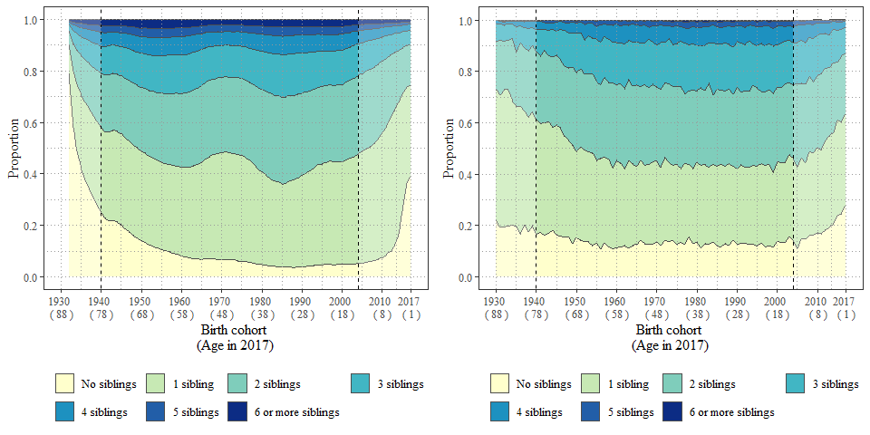

#### Fig. 5b: Average number of cousins by birth cohort and by type of aunt or uncle. Swedish Kinship Universe (left) vs SOCSIM (right)

``` r
Fig5b_SKU <- ggplot() +
  geom_area(data = SKU %>%
            filter(Fig == "Fig5b") %>%
            mutate(type = factor(type,
                                 levels = c("registered deceased",
                                            "father.brother", "father.sister",
                                            "mother.brother", "mother.sister"))) %>% 
            filter(Fig == "Fig5b" & type == "registered deceased"), 
            mapping = aes(x = IDbirthYear, y =  mean_cousins, fill = type), 
            color = "grey30", lwd = 0.5) +
  geom_area(data = SKU %>%
            filter(Fig == "Fig5b") %>%
            mutate(type = factor(type,
                                 levels = c("registered deceased",
                                            "father.brother", "father.sister",
                                            "mother.brother", "mother.sister"))) %>% 
            filter(Fig == "Fig5b" & type != "registered deceased"), 
            mapping = aes(x = IDbirthYear, y =  mean_cousins, fill = type), 
            color = "grey30", lwd = 0.5)+
  geom_area(data=data.frame(x = c(1950,1977), y = c(0,8.5)), aes(x=x,y=y), fill = "white", alpha = 0.2) + 
  geom_area(data=data.frame(x = c(2017-19,2017), y = c(7,7)), aes(x=x,y=y), fill = "white", alpha = 0.2) + 
  geom_vline(xintercept = c(1977, 2017-19), color = "black", lty = 2) +
  scale_fill_manual(values = c("#FFFFCC", "#253494", "#2C7FB8", "#41B6C4", "#A1DAB4"), 
                    limits = c("registered deceased", "father.brother", "father.sister",
                                "mother.brother", "mother.sister"),
                    labels = c("Deceased cousins", "Paternal uncle's side","Paternal aunt's side", 
                               "Maternal uncle's side","Maternal aunt's side")) +
  labs(x = "Birth cohort \n(Age in 2017)", y = "Average number of cousins", fill = "") +
  scale_x_continuous(breaks   = c(seq(1920, 2010,by = 10), 2017), labels = paste(c(seq(1920, 2010,by = 10), 2017), "\n", "(",2018 - c(seq(1920, 2010,by = 10), 2017),")")) +
  theme_bw() +
  theme(panel.grid.major.y = element_line(colour = "grey60", size = 0.3, linetype = 9),
        panel.grid.major.x = element_line(colour = "grey60", size = 0.3, linetype = 9),
        panel.grid.minor = element_line(colour = "grey70", size = 0.3, linetype = 9),
        legend.position = "bottom",
        panel.background = element_rect(fill = NA), 
        panel.ontop = TRUE,
        text = element_text(family = "Times", size = 12)) +
  guides(fill = guide_legend(reverse = F, ncol = 3, byrow = TRUE))


cousin_table <- reference_table_SweBorn %>% 
  filter(refGroup == "cousin" & !is.na(refID) & IDbirthYear >= 1950 & IDbirthYear <= 2017) %>%
  mutate(isAlive = refIDdeathYear > 2017,
         Type    = paste(refTypeIII, refTypeIIII, sep = "_"),
         Type = factor(Type),
         Type = fct_recode(Type,
                           "Father's brother's side, one shared grandparent"  = "father.brother_1" ,
                           "Father's brother's side, two shared grandparents" = "father.brother_2" ,
                           "Father's sister's side, one shared grandparent"   = "father.sister_1"  ,
                           "Father's sister's side, two shared grandparents"  = "father.sister_2"  ,
                           "Mother's brother's side, one shared grandparent"  = "mother.brother_1" ,
                           "Mother's brother's side, two shared grandparents" = "mother.brother_2" ,
                           "Mother's sister's side, one shared grandparent"   = "mother.sister_1"  ,
                           "Mother's sister's side, two shared grandparents"  = "mother.sister_2"),
         Type2 = fct_recode(Type,
                            "Father's side, one shared grandparent"  = "Father's brother's side, one shared grandparent" ,
                            "Father's side, two shared grandparents" = "Father's brother's side, two shared grandparents" ,
                            "Father's side, one shared grandparent"  = "Father's sister's side, one shared grandparent",
                            "Father's side, two shared grandparents" = "Father's sister's side, two shared grandparents"  ,
                            "Mothers's side, one shared grandparent" = "Mother's brother's side, one shared grandparent" ,
                            "Mothers's side, two shared grandparents"= "Mother's brother's side, two shared grandparents" ,
                            "Mothers's side, one shared grandparent" = "Mother's sister's side, one shared grandparent",
                            "Mothers's side, two shared grandparents"= "Mother's sister's side, two shared grandparents"),
         Type3 = refTypeIIII,
         Type4 = refTypeIII) %>%
  setDT() %>% 
  left_join(., select(N_Cohort, IDbirthYear, N_17), by = c("IDbirthYear"))

cousin_tableAlt3 <- rbind(cousin_table[, .(mean_cousins = .N / N_17, Type4 = "not living"),keyby = .(IDbirthYear)],
                          cousin_table[isAlive == TRUE, .(mean_cousins = .N / N_17),keyby = .(IDbirthYear, Type4)]) %>%
  distinct()

cousin_dist_Table <-  reference_table_SweBorn %>%
  filter(refGroup == "cousin" & IDbirthYear >= 1950 & IDbirthYear <= 2017) %>%
  left_join(., select(N_Cohort, IDbirthYear, N_17), by = c("IDbirthYear")) %>%
  mutate(isAlive = refIDdeathYear >= 2017) %>% 
  setDT

cousin_dist_Table_living <- rbind(cousin_dist_Table[is.na(refID),.(n_cousins = 0),keyby = .(ID, IDbirthYear, N_17)][,.(freq = .N),keyby = .(IDbirthYear, N_17, n_cousins)],
                                  cousin_dist_Table[isAlive == TRUE & !is.na(refID),.(n_cousins = .N),keyby = .(ID, IDbirthYear, N_17)][,.(freq = .N),keyby = .(IDbirthYear, N_17, n_cousins)]) %>%
  mutate(n_cousins = ifelse(n_cousins > 5 & n_cousins < 11,"6-10",
                            ifelse(n_cousins > 10,">10",
                                   as.character(n_cousins))),
         n_cousins = factor(n_cousins, levels = c(">10","6-10","5","4","3","2","1","0")),
         n_cousins = fct_recode(n_cousins,
                                "No cousins" = "0",
                                "1 cousin" = "1",
                                "2 cousins" = "2",
                                "3 cousins" = "3",
                                "4 cousins" = "4",
                                "5 cousins" = "5",
                                "6 - 10 cousins" = "6-10",
                                "11 or more cousins" = ">10")) %>%
  .[,.(freq =sum(freq)) ,keyby = .(IDbirthYear,  N_17, n_cousins)]%>%
  .[,.(n_cousins = n_cousins, freq = freq, N_17 = sum(freq), proportion = freq /sum(freq)),keyby = .(IDbirthYear)]


Fig5b_socsim <- ggplot() +
  geom_area(data = cousin_tableAlt3[Type4 == "not living"], 
            mapping = aes(x = IDbirthYear, y = mean_cousins, fill = Type4), color = "grey30", lwd = 0.5) +
  geom_area(data = cousin_tableAlt3[Type4 != "not living"], 
            mapping = aes(x = IDbirthYear, y = mean_cousins, fill = Type4), color = "grey30", lwd = 0.5) +
  geom_area(data=data.frame(x = c(1950,1977), y = c(0,8.5)), aes(x=x,y=y), fill = "white", alpha = 0.2) + 
  geom_area(data=data.frame(x = c(2017-19,2017), y = c(7,7)), aes(x=x,y=y), fill = "white", alpha = 0.2) + 
  geom_vline(xintercept = c(1977, 2017-19), color = "black", lty = 2) +
  scale_fill_manual(values = c("#FFFFCC", "#253494", "#2C7FB8", "#41B6C4", "#A1DAB4"), 
                    limits = c("not living", "father.brother", "father.sister",
                                "mother.brother", "mother.sister"),
                    labels = c("Deceased cousins", "Paternal uncle's side","Paternal aunt's side", 
                               "Maternal uncle's side","Maternal aunt's side")) +
  labs(x = "Birth cohort \n(Age in 2017)", y = "Average number of cousins", fill = "") +
  scale_x_continuous(breaks   = c(seq(1920, 2010,by = 10), 2017), labels = paste(c(seq(1920, 2010,by = 10), 2017), "\n", "(",2018 - c(seq(1920, 2010,by = 10), 2017),")")) +
  theme_bw() +
  theme(panel.grid.major.y = element_line(colour = "grey60", size = 0.3, linetype = 9),
        panel.grid.major.x = element_line(colour = "grey60", size = 0.3, linetype = 9),
        panel.grid.minor = element_line(colour = "grey70", size = 0.3, linetype = 9),
        legend.position = "bottom",
        panel.background = element_rect(fill = NA), 
        panel.ontop = TRUE,
        text = element_text(family = "Times", size = 12)) +
  guides(fill = guide_legend(reverse = F, ncol = 3, byrow = TRUE))

plot_grid(Fig5b_SKU, Fig5b_socsim, align = "hv")
```

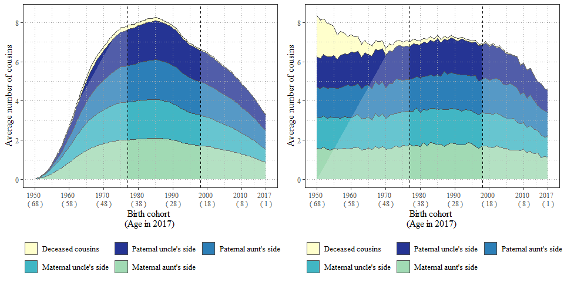

#### Fig. 5a: Proportional distribution of the number of cousins by birth cohort. Swedish Kinship Universe (left) vs SOCSIM (right)

``` r
Fig5a_SKU <- ggplot(data = SKU %>% 
                    filter(Fig == "Fig5a") %>% 
                      mutate(n_cousins = factor(n_cousins, 
                                                 levels = c("11 or more cousins", "6 - 10 cousins", "5 cousins",
                                                            "4 cousins", "3 cousins", "2 cousins", "1 cousin", 
                                                            "No cousins")))) +
  geom_area(mapping = aes(x = IDbirthYear, y = proportion, fill = n_cousins), color = "grey30", lwd = 0.7) +  
  geom_area(data=data.frame(x = c(1950,1977), y = c(1,1)), aes(x=x,y=y), fill = "white", alpha = 0.2) + 
  geom_area(data=data.frame(x = c(2017-19,2017), y = c(1,1)), aes(x=x,y=y), fill = "white", alpha = 0.2) + 
  geom_vline(xintercept = c(1977, 2017-19), color = "black", lty = 2) +
  labs(x = "Birth cohort \n(Age in 2017)", y = "Proportion", fill = "")+
  scale_fill_brewer(palette = "YlGnBu", direction = -1 ) + 
  scale_x_continuous(breaks   = c(seq(1920, 2010,by = 10), 2017), labels = paste(c(seq(1920, 2010,by = 10), 2017), "\n", "(",2018 - c(seq(1920, 2010,by = 10), 2017),")")) +
  scale_y_continuous(breaks = seq(0,1, by = 0.2))+
  theme_bw() +
  guides(fill = guide_legend(reverse = TRUE, nrow = 3, byrow = TRUE)) +
  theme(panel.grid.major.y = element_line(colour = "grey60", size = 0.3, linetype = 9),
        panel.grid.major.x = element_line(colour = "grey60", size = 0.3, linetype = 9),
        panel.grid.minor.y = element_line(colour = "grey60", size = 0.3, linetype = 9),
        panel.grid.minor.x = element_line(colour = "grey60", size = 0.3, linetype = 9),
        legend.position = "bottom",
        panel.background = element_rect(fill = NA), 
        panel.ontop = TRUE,
        text = element_text(family = "Times", size = 12))


Fig5a_socsim <- ggplot(data = cousin_dist_Table_living) +
  geom_area(mapping = aes(x = IDbirthYear, y = proportion, fill = n_cousins), color = "grey30", lwd = 0.7) +  
  geom_area(data=data.frame(x = c(1950,1977), y = c(1,1)), aes(x=x,y=y), fill = "white", alpha = 0.2) + 
  geom_area(data=data.frame(x = c(2017-19,2017), y = c(1,1)), aes(x=x,y=y), fill = "white", alpha = 0.2) + 
  geom_vline(xintercept = c(1977, 2017-19), color = "black", lty = 2) +
  labs(x = "Birth cohort \n(Age in 2017)", y = "Proportion", fill = "")+
  scale_fill_brewer(palette = "YlGnBu", direction = -1 ) + 
  scale_x_continuous(breaks   = c(seq(1920, 2010,by = 10), 2017), labels = paste(c(seq(1920, 2010,by = 10), 2017), "\n", "(",2018 - c(seq(1920, 2010,by = 10), 2017),")")) +
  scale_y_continuous(breaks = seq(0,1, by = 0.2))+
  theme_bw() +
  guides(fill = guide_legend(reverse = TRUE, nrow = 3, byrow = TRUE)) +
  theme(panel.grid.major.y = element_line(colour = "grey60", size = 0.3, linetype = 9),
        panel.grid.major.x = element_line(colour = "grey60", size = 0.3, linetype = 9),
        panel.grid.minor.y = element_line(colour = "grey60", size = 0.3, linetype = 9),
        panel.grid.minor.x = element_line(colour = "grey60", size = 0.3, linetype = 9),
        legend.position = "bottom",
        panel.background = element_rect(fill = NA), 
        panel.ontop = TRUE,
        text = element_text(family = "Times", size = 12))

plot_grid(Fig5a_SKU, Fig5a_socsim, align = "hv")
```


#### Fig. 6a. Average number of living, dead, and unregistered parents, by birth cohort 1932–2017. Swedish Kinship Universe (left) vs SOCSIM (right)

``` r
Fig6a_SKU <- SKU %>%
            filter(Fig == "Fig6a") %>%
  pivot_wider(names_from = Type, values_from = mean_kin) %>% 
  mutate(unregistered = 2-(father + mother + `registered deceased`)) %>%
  pivot_longer(cols = father:unregistered, 
               names_to = "Type", values_to = "mean_kin") %>% 
  mutate(Type = factor(Type,
                       levels = c("unregistered", "registered deceased", 
                                  "father", "mother"))) %>% 
  ggplot() +
  geom_area(mapping = aes(x = IDbirthYear, y =  mean_kin, fill = Type), 
            color = "grey30", lwd = 0.5) +
  geom_vline(xintercept = c(1940), color = "black", lty = 2) +
  labs(x = "Birth cohort \n(Age in 2017)", y = "Average number of parents", fill = "") +
  scale_fill_manual(values = c("#FED98E", "#FFFFCC", "#2C7FB8", "#A1DAB4"),
                    limits = c("unregistered","registered deceased", "father", "mother"),
                    labels = c("Unregistered parents", "Registered deceased parents", "Fathers", "Mothers")) +
  scale_x_continuous(breaks   = c(seq(1920, 2010,by = 10), 2017), labels = paste(c(seq(1920, 2010,by = 10), 2017), "\n", "(",2018 - c(seq(1920, 2010,by = 10), 2017),")")) +
  theme_bw() +
  theme(panel.grid.major.y = element_line(colour = "grey60", size = 0.3, linetype = 9),
        panel.grid.major.x = element_line(colour = "grey60", size = 0.3, linetype = 9),
        panel.grid.minor = element_line(colour = "grey70", size = 0.3, linetype = 9),
        legend.position = "bottom",
        legend.key.height = unit(1, "line"),
        panel.background = element_rect(fill = NA), 
        panel.ontop = TRUE,
        text = element_text(family = "Times", size = 12)) +
  guides(fill = guide_legend(override.aes = list(color = 0), ncol = 2, byrow = TRUE))


parent_table <- 
  reference_table_SweBorn %>% 
  filter(refGroup == "parent" & !is.na(refID) & IDbirthYear >= 1930 & IDbirthYear <= 2017) %>%
  filter(!is.na(refIDdeathYear)) %>% 
  mutate(
    isAlive = refIDdeathYear > 2017
    , refTypeII = ifelse(!isAlive, "not living", refTypeII)
    , Type = as.factor(refTypeII)
    ) %>%
  setDT() %>% 
  left_join(., select(N_Cohort, IDbirthYear, N_17), by = c("IDbirthYear"))

parent_table  <- 
  rbind(
    parent_table[isAlive == TRUE, .(mean_kin = .N / N_17),keyby = .(IDbirthYear, Type)]
    , parent_table[, .(mean_kin = .N / N_17, Type = "not living"),keyby = .(IDbirthYear)]
    ) %>%
  distinct() %>% 
  mutate(new = 2)

Fig6a_socsim <- ggplot() +
  geom_area(data = parent_table[Type == "not living"], mapping = aes(x = IDbirthYear, y = mean_kin, fill = Type), color = "grey30", lwd = 0.5) +
  geom_area(data = parent_table[Type != "not living"], mapping = aes(x = IDbirthYear, y = mean_kin, fill = Type), color = "grey30", lwd = 0.5) +
  geom_vline(xintercept = c(1940), color = "black", lty = 2) +
  labs(x = "Birth cohort \n(Age in 2017)", y = "Average number of parents", fill = "") +
  scale_fill_manual(values = c("white", "#FFFFCC", "#2C7FB8", "#A1DAB4"),
                    limits = c("", "not living", "father", "mother"),
                    labels = c("", "Registered deceased parents", "Fathers", "Mothers")) +
  scale_x_continuous(breaks   = c(seq(1920, 2010,by = 10), 2017), labels = paste(c(seq(1920, 2010,by = 10), 2017), "\n", "(",2018 - c(seq(1920, 2010,by = 10), 2017),")")) +
  theme_bw() +
  theme(panel.grid.major.y = element_line(colour = "grey60", size = 0.3, linetype = 9),
        panel.grid.major.x = element_line(colour = "grey60", size = 0.3, linetype = 9),
        panel.grid.minor = element_line(colour = "grey70", size = 0.3, linetype = 9),
        legend.position = "bottom",
        legend.key.height = unit(1, "line"),
        panel.background = element_rect(fill = NA), 
        panel.ontop = TRUE,
        text = element_text(family = "Times", size = 12)) +
  guides(fill = guide_legend(override.aes = list(color = 0), ncol = 2, byrow = TRUE))

plot_grid(Fig6a_SKU, Fig6a_socsim, align = "hv")
```

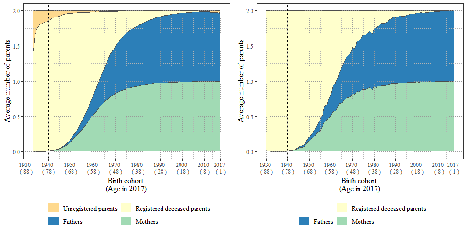

#### Fig. 6b. Average number of parent siblings by birth cohort 1950–2017. Swedish Kinship Universe (left) vs SOCSIM (right)

``` r
Fig6b_SKU <- ggplot() +
  geom_area(data = SKU %>% 
              filter(Fig == "Fig6b") %>% 
              mutate(type = factor(type,
                                   levels = c("registered deceased", "father brother", "father sister", "mother brother", "mother sister"))) %>% 
              filter(Fig == "Fig6b" & type == "registered deceased"), 
            mapping = aes(x = IDbirthYear, y =  mean_kin, fill = type), 
            color = "grey30", lwd = 0.7) + 
    geom_area(data = SKU %>% 
              filter(Fig == "Fig6b") %>% 
              mutate(type = factor(type,
                                   levels = c("registered deceased", "father brother", "father sister", "mother brother", "mother sister"))) %>% 
              filter(Fig == "Fig6b" & type != "registered deceased"), 
            mapping = aes(x = IDbirthYear, y =  mean_kin, fill = type), 
            color = "grey30", lwd = 0.7) +
  geom_area(data=data.frame(x = c(1950,1977), y = c(0,5)), aes(x=x,y=y), fill = "white", alpha = 0.2) + 
  geom_vline(xintercept = c(1977), color = "black", lty = 2) +
  labs(x = "Birth cohort \n(Age in 2017)", y = "Average number of aunts/uncles", fill = "") +
  scale_fill_manual(values = c("#FFFFCC", "#A1DAB4", "#41B6C4", "#2C7FB8", "#253494"), 
                    limits = c("registered deceased", "father brother", "father sister", "mother brother", "mother sister"),
                    labels = c("Deceased parental siblings", "Paternal uncle", "Paternal aunt", "Maternal uncle", "Maternal aunt")) +
  scale_x_continuous(breaks   = c(seq(1920, 2010,by = 10), 2017), labels = paste(c(seq(1920, 2010,by = 10), 2017), "\n", "(",2018 - c(seq(1920, 2010,by = 10), 2017),")")) +
  theme_bw() +
  theme(panel.grid.major.y = element_line(colour = "grey60", size = 0.3, linetype = 9),
        panel.grid.major.x = element_line(colour = "grey60", size = 0.3, linetype = 9),
        panel.grid.minor = element_line(colour = "grey70", size = 0.3, linetype = 9),
        legend.position = "bottom",
        legend.key.height = unit(1, "line"),
        panel.background = element_rect(fill = NA), 
        panel.ontop = TRUE,
        text = element_text(family = "Times", size = 12)) +
  guides(fill = guide_legend(override.aes = list(color = 0), ncol = 3, byrow = TRUE))


parsib_table <- reference_table_SweBorn %>% 
  filter(refGroup == "parsib" & !is.na(refID) & IDbirthYear >= 1950 & IDbirthYear <= 2017) %>%
  mutate(isAlive = refIDdeathYear > 2017,
         Type =  paste(refTypeIII, "'s ", refTypeIIII, " sibling's", " side", sep = ""),
         Type = factor(Type, levels = c("father's half sibling's side", "father's full sibling's side","mother's half sibling's side", "mother's full sibling's side")),
         refTypeII = case_when(refTypeII == "aunt" ~ "sister",
                               refTypeII == "uncle" ~ "brother",
                               TRUE ~ refTypeII),
         Type2  = paste(refTypeIII, "'s ", refTypeIIII," ", refTypeII, "'s", " side", sep = ""),
         Type2 = factor(Type2, levels = c("father's half brother's side",
                                          "father's full brother's side",
                                          "father's half sister's side",
                                          "father's full sister's side",
                                          "mother's half brother's side",
                                          "mother's full brother's side",
                                          "mother's half sister's side",
                                          "mother's full sister's side")),
         Type3 = refTypeIIII,
         Type4 = paste(refTypeIII, refTypeII, sep = " ")) %>%
  setDT() %>% 
  left_join(., select(N_Cohort, IDbirthYear, N_17), by = c("IDbirthYear"))

parsib_tableAlt3  <- rbind(parsib_table[, .(mean_kin = .N / N_17, Type4 = "not living"),keyby = .(IDbirthYear)],
                           parsib_table[isAlive == TRUE, .(mean_kin = .N / N_17),keyby = .(IDbirthYear, Type4)]) %>%
  distinct()

Fig6b_socsim <- ggplot() +
  geom_area(data = parsib_tableAlt3[Type4 == "not living"], mapping = aes(x = IDbirthYear, y = mean_kin, fill = Type4), color = "grey30", lwd = 0.5) +
  geom_area(data = parsib_tableAlt3[Type4 != "not living"], mapping = aes(x = IDbirthYear, y = mean_kin, fill = Type4), color = "grey30", lwd = 0.5) +
  geom_area(data=data.frame(x = c(1950,1977), y = c(0,5)), aes(x=x,y=y), fill = "white", alpha = 0.2) + 
  geom_vline(xintercept = c(1977), color = "black", lty = 2) +
  labs(x = "Birth cohort \n(Age in 2017)", y = "Average number of aunts/uncles", fill = "") +
  scale_fill_manual(values = c("#FFFFCC", "#A1DAB4", "#41B6C4", "#2C7FB8", "#253494"), 
                    limits = c("not living", "father brother", "father sister", "mother brother", "mother sister"),
                    labels = c("Deceased parental siblings", "Paternal uncle", "Paternal aunt", "Maternal uncle", "Maternal aunt")) +
  scale_x_continuous(breaks   = c(seq(1920, 2010,by = 10), 2017), labels = paste(c(seq(1920, 2010,by = 10), 2017), "\n", "(",2018 - c(seq(1920, 2010,by = 10), 2017),")")) +
  theme_bw() +
  theme(panel.grid.major.y = element_line(colour = "grey60", size = 0.3, linetype = 9),
        panel.grid.major.x = element_line(colour = "grey60", size = 0.3, linetype = 9),
        panel.grid.minor = element_line(colour = "grey70", size = 0.3, linetype = 9),
        legend.position = "bottom",
        legend.key.height = unit(1, "line"),
        panel.background = element_rect(fill = NA), 
        panel.ontop = TRUE,
        text = element_text(family = "Times", size = 12)) +
  guides(fill = guide_legend(override.aes = list(color = 0), ncol = 3, byrow = TRUE))

plot_grid(Fig6b_SKU, Fig6b_socsim, align = "hv")
```

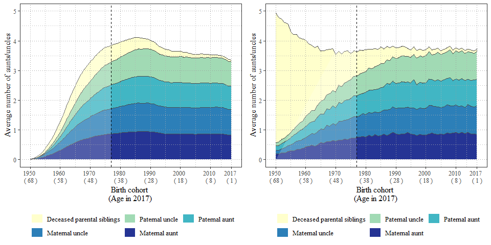

#### Fig. 7: Average number of living, dead, and unregistered grandparents, by birth cohort. Swedish Kinship Universe (left) vs SOCSIM (right)

``` r
SKU_7 <- SKU %>%
  filter(Fig == "Fig7") %>% 
  pivot_wider(names_from = type, values_from = mean_kin) %>% 
  # Add dummy variable to complete the plot with the unregistered
  # The registered deceased from the table include both the living and the deceased
  mutate(unregistered = 4) %>% 
  pivot_longer(cols = c(14:19), 
               names_to = "type", values_to = "mean_kin") %>%
  mutate(type = factor(type,
                       levels = c("unregistered", 
                                  "registered deceased", 
                                  "grandfather (father's side)",
                                  "grandmother (father's side)",
                                  "grandfather (mother's side)",
                                  "grandmother (mother's side)")))
  
Fig7_SKU  <- ggplot() +
  geom_area(data = SKU_7 %>% 
              filter(type == "unregistered"),
            mapping = aes(x = IDbirthYear, y =  mean_kin, fill = type),
              color = "grey30", lwd = 0.7) +
    geom_area(data = SKU_7 %>% 
              filter(type == "registered deceased"), 
            mapping = aes(x = IDbirthYear, y =  mean_kin, fill = type), 
              color = "grey30", lwd = 0.7) + 
    geom_area(data = SKU_7 %>% 
              filter(type != "registered deceased" & type != "unregistered"), 
            mapping = aes(x = IDbirthYear, y =  mean_kin, fill = type), 
              color = "grey30", lwd = 0.7) +
  geom_vline(xintercept = c(1977), color = "black", lty = 2) +
  scale_fill_manual(values = c("#FED98E", "#FFFFCC", "#A1DAB4", "#41B6C4", "#2C7FB8", "#253494"),
                    limits = c("unregistered", 
                               "registered deceased", 
                               "grandfather (father's side)", 
                               "grandmother (father's side)", 
                               "grandfather (mother's side)",
                               "grandmother (mother's side)"), 
                    labels = c("Unregistered grandparents", 
                      "Registered deceased grandparents", "Paternal grandfather", "Paternal grandmother", "Maternal grandfather", "Maternal grandmother")) +
  labs(x = "Birth cohort \n(Age in 2017)", y = "Average number of grandparents", fill = "") +
  scale_x_continuous(breaks   = c(seq(1920, 2010,by = 10), 2017), labels = paste(c(seq(1920, 2010,by = 10), 2017), "\n", "(",2018 - c(seq(1920, 2010,by = 10), 2017),")")) +
  theme_bw() +
  theme(panel.grid.major.y = element_line(colour = "grey60", size = 0.3, linetype = 9),
        panel.grid.major.x = element_line(colour = "grey60", size = 0.3, linetype = 9),
        panel.grid.minor = element_line(colour = "grey70", size = 0.3, linetype = 9),
        legend.position = "bottom",
        legend.key.height = unit(1, "line"),
        panel.background = element_rect(fill = NA), 
        panel.ontop = TRUE,
        text = element_text(family = "Times", size = 12)) +
  guides(fill = guide_legend(override.aes = list(color = 0), ncol = 2, byrow = TRUE))  

grandparent_table <- 
  reference_table_SweBorn %>% 
  filter(refGroup == "grandparent" & !is.na(refID) & IDbirthYear >= 1950 & IDbirthYear <= 2017) %>%
  mutate(isAlive = refIDdeathYear > 2017,
         Type  = paste(refTypeII, " (", refTypeIII, "'s side)", sep = ""),
         Type2 = paste(refTypeIII, "'s side", sep = "")) %>%
  setDT() %>% 
  left_join(., select(N_Cohort, IDbirthYear, N_17), by = c("IDbirthYear"))

grandparent_table  <- 
  rbind(
    grandparent_table[, .(mean_kin = .N / N_17, Type = "not living"),keyby = .(IDbirthYear)]
    , grandparent_table[isAlive == TRUE, .(mean_kin = .N / N_17),keyby = .(IDbirthYear, Type)]
    ) %>%
  distinct() %>% 
  mutate(Type = factor(Type, levels = c("not living", 
                                         "grandfather (father's side)",
                                         "grandmother (father's side)",
                                         "grandfather (mother's side)",
                                         "grandmother (mother's side)")))

Fig7_socsim <- ggplot() +
  geom_area(data = grandparent_table[Type == "not living"], mapping = aes(x = IDbirthYear, y = mean_kin, fill = Type), color = "grey30", lwd = 0.5) +
  geom_area(data = grandparent_table[Type != "not living"], mapping = aes(x = IDbirthYear, y = mean_kin, fill = Type), color = "grey30", lwd = 0.5) +
  geom_vline(xintercept = c(1977), color = "black", lty = 2) +
  scale_fill_manual(values = c("white", "#FFFFCC", "#A1DAB4", "#41B6C4", "#2C7FB8", "#253494"),
                    limits = c("", "not living", 
                               "grandfather (father's side)", 
                               "grandmother (father's side)", 
                               "grandfather (mother's side)",
                               "grandmother (mother's side)"), 
                    labels = c("", "Registered deceased grandparents", "Paternal grandfather", "Paternal grandmother", "Maternal grandfather", "Maternal grandmother")) +
  labs(x = "Birth cohort \n(Age in 2017)", y = "Average number of grandparents", fill = "") +
  scale_x_continuous(breaks   = c(seq(1920, 2010,by = 10), 2017), labels = paste(c(seq(1920, 2010,by = 10), 2017), "\n", "(",2018 - c(seq(1920, 2010,by = 10), 2017),")")) +
  theme_bw() +
  theme(panel.grid.major.y = element_line(colour = "grey60", size = 0.3, linetype = 9),
        panel.grid.major.x = element_line(colour = "grey60", size = 0.3, linetype = 9),
        panel.grid.minor = element_line(colour = "grey70", size = 0.3, linetype = 9),
        legend.position = "bottom",
        legend.key.height = unit(1, "line"),
        panel.background = element_rect(fill = NA), 
        panel.ontop = TRUE,
        text = element_text(family = "Times", size = 12)) +
  guides(fill = guide_legend(override.aes = list(color = 0), ncol = 2, byrow = TRUE))
    
plot_grid(Fig7_SKU, Fig7_socsim, align = "hv")
```

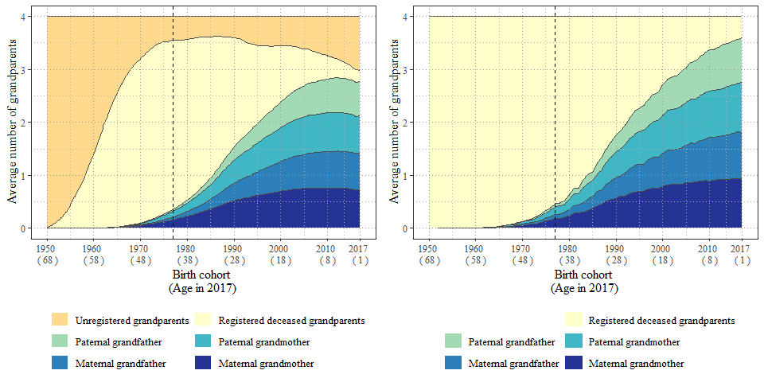

#### Fig. 8a: Distribution of the total number of kin by birth cohort 1915–2017

``` r
violinTable_kin <- reference_table_SweBorn %>%
  filter(!is.na(refID) & IDbirthYear %in% c(1920, 1930, 1940, 1950, 1960, 1970, 1980,1990,2000, 2010)) %>%
  mutate(isAlive = refIDdeathYear >= 2018) %>%
  left_join(., select(N_Cohort, IDbirthYear, N_17), by = "IDbirthYear") %>%
  setDT()

violinTable_kin_living  <- violinTable_kin[isAlive == TRUE,.(n = .N),keyby = .(IDbirthYear,ID, N_17)][,.(freq = .N),.(IDbirthYear,N_17,n)] %>%
  rbind(.,.[,.(n=0, freq = N_17 - sum(freq)),keyby = .(IDbirthYear, N_17)]) %>% 
  arrange(IDbirthYear, n)

violinTable_kin  <- violinTable_kin[,.(n = .N),keyby = .(IDbirthYear,ID, N_17)][,.(freq = .N),.(IDbirthYear,N_17,n)] %>%
  rbind(.,.[,.(n=0, freq = N_17 - sum(freq)),keyby = .(IDbirthYear, N_17)]) %>% 
  arrange(IDbirthYear, n)

boxplotTable_kin_living <- violinTable_kin_living[,.(n = n, q=cumsum(freq/N_17)),keyby = .(IDbirthYear, N_17)] %>%
  mutate(lim = ifelse(q > 0.025, "qmin"   , FALSE),
         lim = ifelse(q > 0.25 , "qlower" , lim),
         lim = ifelse(q > 0.5  , "qmiddle", lim),
         lim = ifelse(q > 0.75 , "qupper" , lim),
         lim = ifelse(q > 0.975, "qmax"   , lim)) %>%
  distinct(IDbirthYear, lim, .keep_all = TRUE) %>%
  select(IDbirthYear,lim, n)  %>%
  dcast(.,IDbirthYear ~ lim, value.var = "n")

boxplotTable_kin <- violinTable_kin[,.(n = n, q=cumsum(freq/N_17)),keyby = .(IDbirthYear, N_17)] %>%
  mutate(lim = ifelse(q > 0.025, "qmin"   , FALSE),
         lim = ifelse(q > 0.25 , "qlower" , lim),
         lim = ifelse(q > 0.5  , "qmiddle", lim),
         lim = ifelse(q > 0.75 , "qupper" , lim),
         lim = ifelse(q > 0.975, "qmax"   , lim)) %>%
  distinct(IDbirthYear, lim, .keep_all = TRUE) %>%
  select(IDbirthYear,lim, n)  %>%
  dcast(.,IDbirthYear ~ lim, value.var = "n")

annotate_living <-left_join(select(boxplotTable_kin_living, IDbirthYear, qmiddle), violinTable_kin_living, by = c("IDbirthYear"="IDbirthYear", "qmiddle"="n" ))


Fig8a_socsim <- ggplot() +
  geom_violin(data  = violinTable_kin_living,  mapping = aes(x = IDbirthYear, y = n, weight = freq, fill = as.factor(IDbirthYear)),
              scale = "area", bw = 1) +
  geom_boxplot(data = boxplotTable_kin_living, mapping = aes(x = IDbirthYear,ymin = qmin, lower = qlower, middle = qmiddle, upper = qupper, ymax = qmax, fill = as.factor(IDbirthYear)),stat = "identity", 
               width = 1.5, show.legend = FALSE, color = "maroon")+
  scale_fill_manual(values = c("white", "#FFFFD9", "#EDF8B1", "#C7E9B4", "#7FCDBB", "#41B6C4", "#1D91C0", "#225EA8", "#253494", "#081D58"))+ 
  labs(x = "Birth cohort \n(Age in 2017)", y = "Total number of living kin") +
  scale_y_continuous(breaks = seq(0,80, by = 10), limits = c(0,70)) + 
  scale_x_continuous(breaks   = seq(1920, 2010, by=10), 
                     labels = paste(seq(1920, 2010, by=10), "\n", "(",2018 -seq(1920, 2010, by=10),")"),
                     sec.axis = dup_axis(name = "Percentage with median number of kin by cohort", labels = round( 100* annotate_living$freq / annotate_living$N_17, 2))) +
  theme_bw() +
  theme(panel.grid.major.y = element_line(colour = "grey70", size = 0.3, linetype = 9),
        panel.grid.major.x = element_blank(),
        panel.grid.minor.y = element_line(colour = "grey70", size = 0.3, linetype = 9),
        panel.grid.minor.x = element_blank(),
        legend.position = "none",
        panel.background = element_rect(fill = NA), 
        panel.ontop = TRUE,
        text = element_text(family = "Times", size = 12)) 

Fig8a_socsim
```

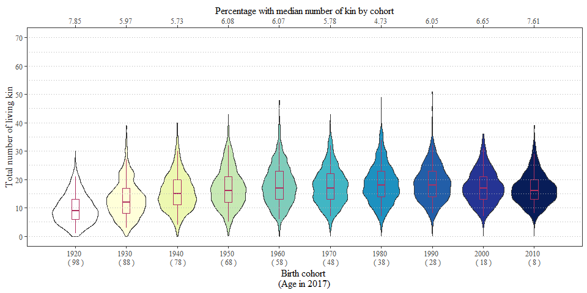

#### Fig. 8b: Average number of all types of kin by birth cohort 1915–2017

``` r
Fig8b_SKU <- SKU %>%
            filter(Fig == "Fig8b") %>% 
  mutate(type = factor(type,
                       levels = c("registered deceased", "grandchild", "child", "sibchild", "sibling", "cousin", "parent", "parsib", "grandparent"))) %>%
  ggplot() +
  geom_area(mapping = aes(x = IDbirthYear, y =  mean_kin, fill = type), 
            color = "grey30", lwd = 0.5) +
  labs(x = "Birth cohort \n(Age in 2017)", y = "Average number of kin", fill = "") +
  scale_fill_manual(values =c("#FFFFD9","#081D58","#253494","#225EA8","#1D91C0","#41B6C4","#7FCDBB","#C7E9B4","#EDF8B1"),
                    limits = c("registered deceased", "grandchild", "child", "sibchild", "sibling", "cousin", "parent", "parsib", "grandparent"),
                    labels = c("Deceasead kin", "Grandchildren", "Children", "Nieces and nephews", "Siblings", "Cousins", "Parents", "Aunts and uncles", "Grandparents")) +
  scale_x_continuous(breaks   = c(seq(1920, 2010,by = 10), 2017), labels = paste(c(seq(1920, 2010,by = 10), 2017), "\n", "(",2018 - c(seq(1920, 2010,by = 10), 2017),")")) +
  theme_bw() +
  theme(panel.grid.major.y = element_line(colour = "grey60", size = 0.3, linetype = 9),
        panel.grid.major.x = element_line(colour = "grey60", size = 0.3, linetype = 9),
        panel.grid.minor = element_line(colour = "grey70", size = 0.3, linetype = 9),
        legend.position = "right",
        legend.key.height = unit(1, "line"),
        panel.background = element_rect(fill = NA), 
        panel.ontop = TRUE,
        text = element_text(family = "Times", size = 12)) +
  guides(fill = guide_legend(override.aes = list(color = 0))) +
  expand_limits(y = c(0, 43))


totalkin_table <- reference_table_SweBorn %>% 
  filter(!is.na(refID) & IDbirthYear >= 1915 & IDbirthYear <= 2017) %>%
  mutate(isAlive = refIDdeathYear > 2017,
         Type = as.factor(refGroup)) %>%
  setDT() %>% 
  left_join(., select(N_Cohort, IDbirthYear, N_17), by = c("IDbirthYear"))


totalkin_table  <- rbind(totalkin_table[, .(mean_kin = .N / N_17, Type = "not living"),keyby = .(IDbirthYear)],
                         totalkin_table[isAlive == TRUE, .(mean_kin = .N / N_17),keyby = .(IDbirthYear, Type)]) %>%
  distinct()%>%
  mutate(Type = factor(Type, levels = c("not living", "grandchild","child","sibchild","sibling","cousin","parent","parsib","grandparent")))


totalkin_table <- rbind(totalkin_table, data.frame(IDbirthYear = 1931,
                                                   mean_kin = 0,
                                                   Type = c("sibchild", "sibling")))

Fig8b_socsim <- ggplot() +
  geom_area(data = totalkin_table[Type == "not living"], mapping = aes(x = IDbirthYear, y = mean_kin, fill = Type), color = "grey30", lwd = 0.5) +
  geom_area(data = totalkin_table[Type != "not living"], mapping = aes(x = IDbirthYear, y = mean_kin, fill = Type), color = "grey30", lwd = 0.5) +
  labs(x = "Birth cohort \n(Age in 2017)", y = "Average number of kin", fill = "") +
  scale_fill_manual(values =c("#FFFFD9","#081D58","#253494","#225EA8","#1D91C0","#41B6C4","#7FCDBB","#C7E9B4","#EDF8B1"),
                    limits = c("not living", "grandchild", "child", "sibchild", "sibling", "cousin", "parent", "parsib", "grandparent"),
                    labels = c("Deceasead kin", "Grandchildren", "Children", "Nieces and nephews", "Siblings", "Cousins", "Parents", "Aunts and uncles", "Grandparents")) +
  scale_x_continuous(breaks   = c(seq(1920, 2010,by = 10), 2017), labels = paste(c(seq(1920, 2010,by = 10), 2017), "\n", "(",2018 - c(seq(1920, 2010,by = 10), 2017),")")) +
  theme_bw() +
  theme(panel.grid.major.y = element_line(colour = "grey60", size = 0.3, linetype = 9),
        panel.grid.major.x = element_line(colour = "grey60", size = 0.3, linetype = 9),
        panel.grid.minor = element_line(colour = "grey70", size = 0.3, linetype = 9),
        legend.position = "right",
        legend.key.height = unit(1, "line"),
        panel.background = element_rect(fill = NA), 
        panel.ontop = TRUE,
        text = element_text(family = "Times", size = 12)) +
  guides(fill = guide_legend(override.aes = list(color = 0)))

plot_grid(Fig8b_SKU, Fig8b_socsim, align = "hv")
```

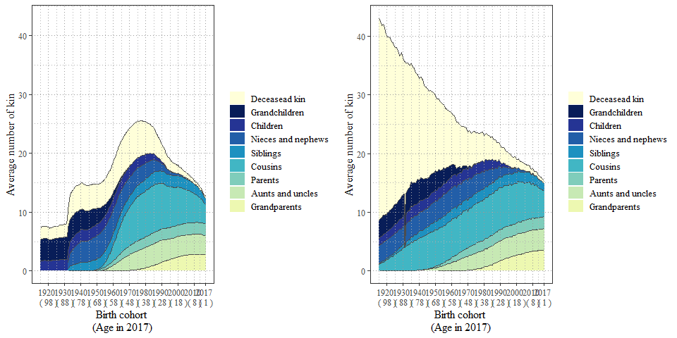
