Kinship networks over time: comparing Swedish population registers and
microsimulation outputs
================
…
2024-02-19

#### Fig. 1b: Average number of living and dead grandchildren in 2017 by sex and birth cohort. Microsimulation - SOCSIM (left) vs Registers - Swedish Kinship Universe (right)

#### Fig. 1a: Proportional distribution of the number of living grandchildren in 2017 by sex and birth cohort. Microsimulation - SOCSIM (left) vs Registers - Swedish Kinship Universe (right)

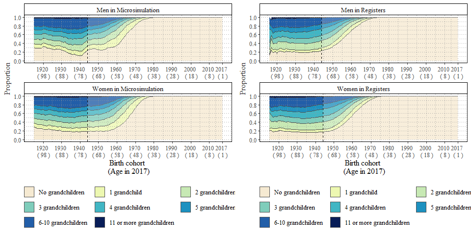

#### Fig. 2b: Average number of living and dead children in 2017 by sex and birth cohort. Microsimulation - SOCSIM (left) vs Registers - Swedish Kinship Universe (right)

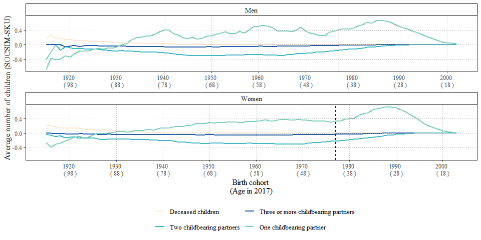

#### Fig. 2a: Proportional distribution of the number of living children in 2017 by sex and birth cohort. Microsimulation - SOCSIM (left) vs Registers - Swedish Kinship Universe (right)

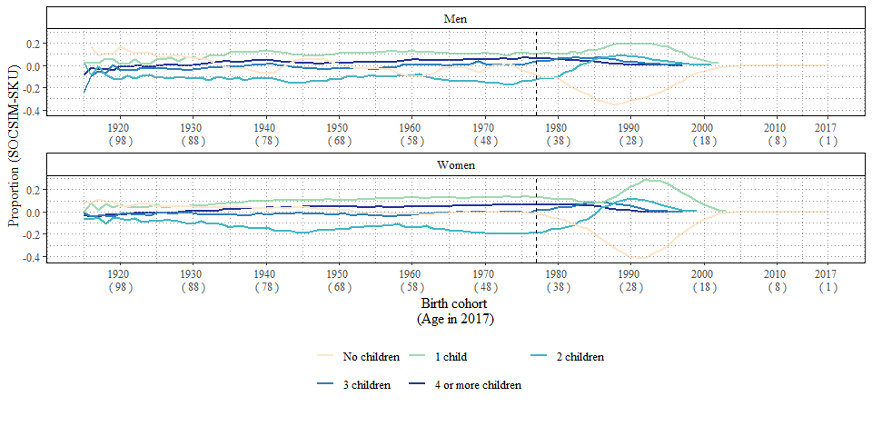

#### Fig. 3: Average number of nieces and nephews by birth cohort and through full or half-sister/brother. Microsimulation - SOCSIM (left) vs Registers - Swedish Kinship Universe (right)

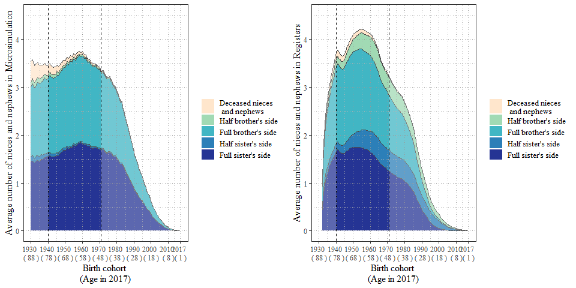
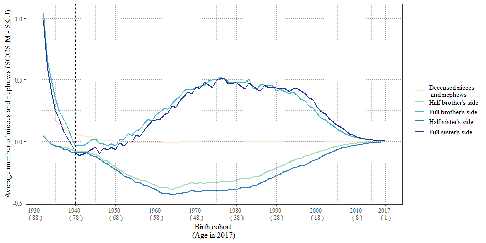

#### Fig. 4a: Average number of siblings by birth cohort and whether full or half-sibling by birth cohort. Microsimulation - SOCSIM (left) vs Registers - Swedish Kinship Universe (right)

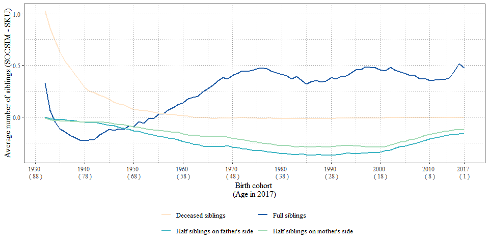

#### Fig. 4b: Proportional distribution of the number of siblings (half- or full) by birth cohort. Microsimulation - SOCSIM (left) vs Registers - Swedish Kinship Universe (right)

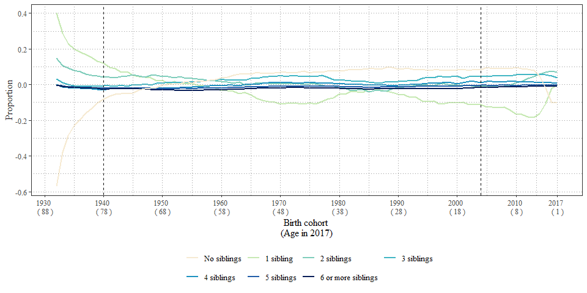

#### Fig. 5b: Average number of cousins by birth cohort and by type of aunt or uncle. Microsimulation - SOCSIM (left) vs Registers - Swedish Kinship Universe (right)

#### Fig. 5a: Proportional distribution of the number of cousins by birth cohort. Microsimulation - SOCSIM (left) vs Registers - Swedish Kinship Universe (right)

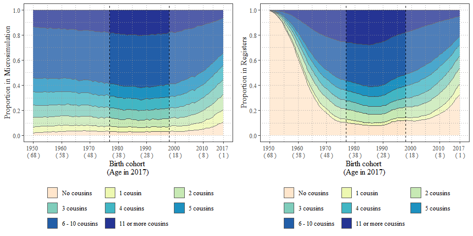
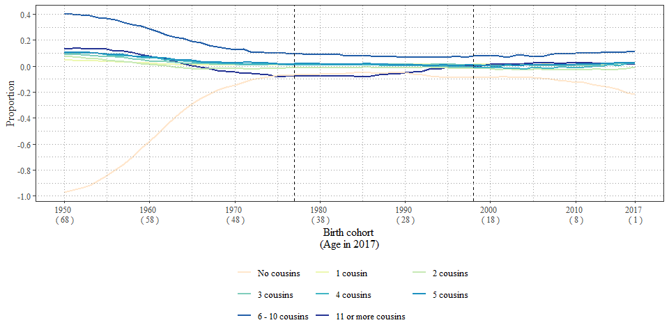

#### Fig. 6a. Average number of living, dead, and unregistered parents, by birth cohort 1932–2017. Microsimulation - SOCSIM (left) vs Registers - Swedish Kinship Universe (right)

#### Fig. 6b. Average number of parent siblings by birth cohort 1950–2017. Microsimulation - SOCSIM (left) vs Registers - Swedish Kinship Universe (right)

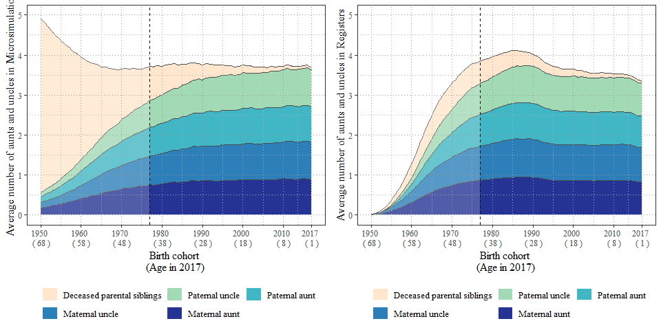

#### Fig. 7: Average number of living, dead, and unregistered grandparents, by birth cohort. Microsimulation - SOCSIM (left) vs Registers - Swedish Kinship Universe (right)

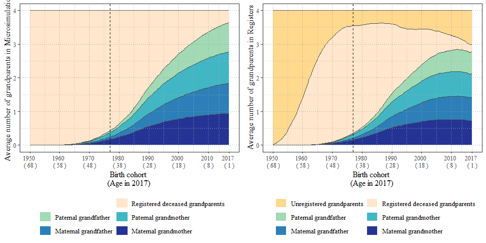
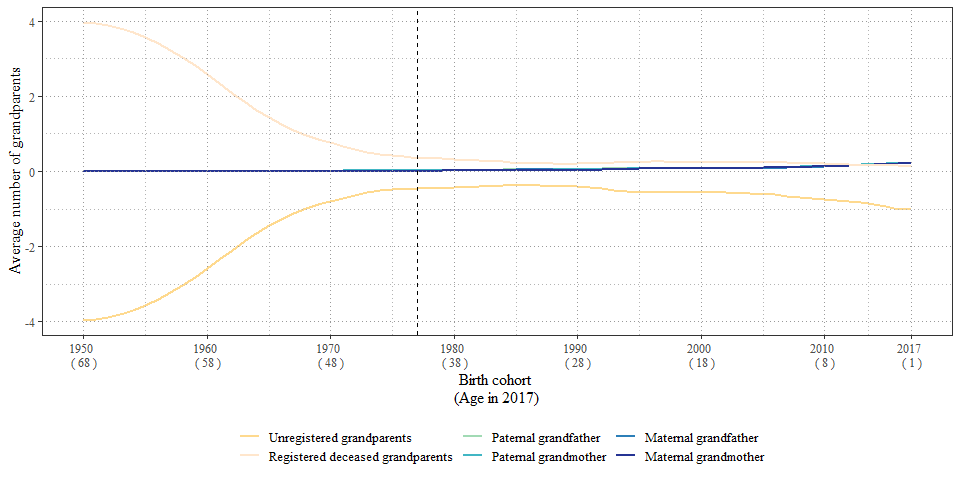

#### Fig. 8a: Distribution of the total number of kin by birth cohort 1915–2017. SOCSIM outputs

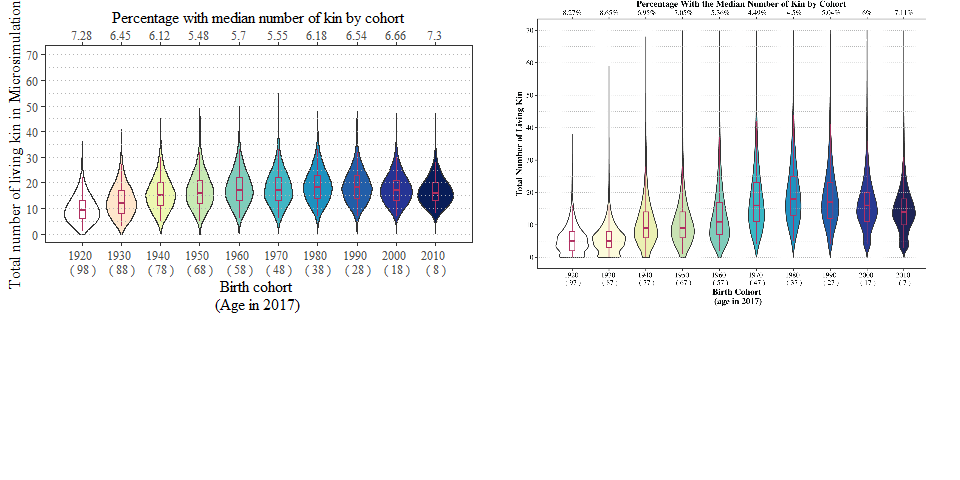

#### Fig. 8b: Average number of all types of kin by birth cohort 1915–2017. Microsimulation - SOCSIM (left) vs Registers - Swedish Kinship Universe (right)

